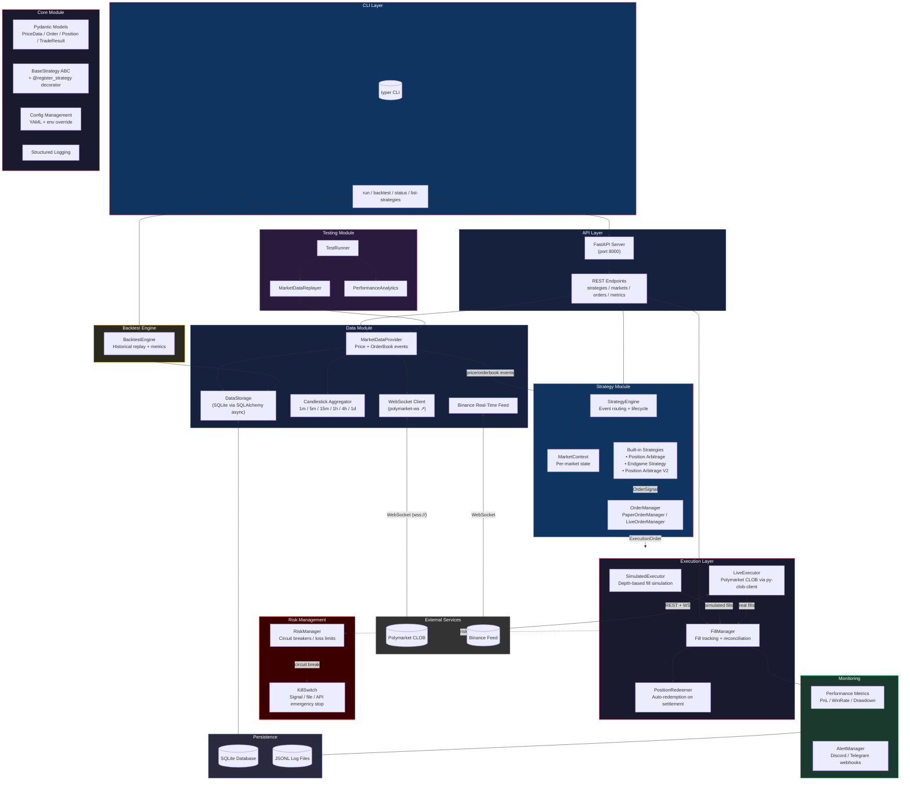

# Polymoney — Polymarket Automated Trading Bot Framework

[](https://github.com/jsyqrt/polymoney/actions/workflows/ci.yml) [](https://www.python.org/downloads/) [](LICENSE) [](https://github.com/astral-sh/ruff)

> A modular, production-grade Python framework for building, backtesting, and deploying automated trading strategies on [Polymarket](https://polymarket.com) — the leading decentralized prediction market. Built for quantitative traders and algorithmic developers who need a reliable, extensible platform.

---

## Architecture

The following diagram illustrates the system architecture and data flow:



---

## Features

- 📡 **Real-Time Market Data** — Persistent WebSocket connections to Polymarket CLOB for live orderbook snapshots, trade streams, and price updates
- 🕯️ **Multi-Interval Candlesticks** — Automatic OHLCV aggregation across 1m, 5m, 15m, 1h, 4h, and 1d intervals
- 🧩 **Pluggable Strategy System** — Decorator-based strategy registry (`@register_strategy`) with hot-reload capable architecture
- 💸 **Paper & Live Trading** — Seamless switching between simulated execution (depth-based fill simulation) and real Polymarket CLOB trading
- ⏪ **Backtesting Engine** — Replay historical data through strategies with configurable start/end dates and performance metrics
- 🧪 **Testing Framework** — Market data replayer, test runner, and performance analytics for strategy validation before deployment
- 🛡️ **Risk Management** — Circuit breakers, loss limits, exposure caps, and emergency kill switch (signal, file, or API-triggered)
- 🔔 **Monitoring & Alerts** — Webhook-based notifications via Discord/Telegram, structured trade logging to JSONL, performance dashboards
- 🌐 **REST API** — Full control plane via FastAPI: manage strategies, subscribe to markets, query orders, check metrics
- 🖥️ **CLI Interface** — Rich command-line tool with `run`, `backtest`, `status`, `list-strategies` commands
- 💾 **Persistent Storage** — Async SQLite via SQLAlchemy for trade history, positions, and market data
- 🔄 **Binance Feed Integration** — Real-time crypto price feed for cross-exchange signal validation
- 🎯 **Automated Position Redemption** — Auto-redeem winning positions at market settlement

---

## Tech Stack

| Layer | Technology | Purpose |
|-------|-----------|---------|
| **Language** | Python 3.10+ | Runtime |
| **CLI** | [typer](https://typer.tiangolo.com/) + [rich](https://rich.readthedocs.io/) | Command-line interface |
| **API Server** | [FastAPI](https://fastapi.tiangolo.com/) + [uvicorn](https://www.uvicorn.org/) | REST API for monitoring & control |
| **Data Validation** | [Pydantic v2](https://docs.pydantic.dev/latest/) | All models, configs, API schemas |
| **Database** | [SQLAlchemy 2.0](https://www.sqlalchemy.org/) (async) + [aiosqlite](https://github.com/omnilib/aiosqlite) | Persistent storage |
| **WebSocket** | [websockets](https://websockets.readthedocs.io/) ≥ 12.0 | Real-time market data streams |
| **Polymarket SDK** | [py-clob-client](https://github.com/polymarket/py-clob-client) | CLOB REST + WebSocket API |
| **Configuration** | [PyYAML](https://pyyaml.org/) + [python-dotenv](https://github.com/theskumar/python-dotenv) | YAML config + env override |
| **HTTP Client** | [httpx](https://www.python-httpx.org/) | Async HTTP requests |
| **Linting** | [ruff](https://docs.astral.sh/ruff/) | Fast Python linter/formatter |
| **Type Checking** | [mypy](https://mypy-lang.org/) | Static type analysis |
| **Testing** | [pytest](https://docs.pytest.org/) + [pytest-asyncio](https://pytest-asyncio.readthedocs.io/) | Async test suite |

---

## Quick Start

### Prerequisites

- Python 3.10, 3.11, or 3.12
- A Polymarket wallet (for live trading) or just curiosity (for paper trading)

### Installation

```bash
# Clone the repository
git clone https://github.com/jsyqrt/polymoney.git
cd polymoney

# Create and activate virtual environment
python -m venv venv
source venv/bin/activate  # On Windows: venv\Scripts\activate

# Install in development mode (with dev dependencies)
pip install -e ".[dev]"
```

### Configuration

Create a `.env` file in the project root:

```env
# Required for live trading
POLYMARKET_PRIVATE_KEY=your_private_key_hex
POLYMARKET_FUNDER=0xYourProxyAddress

# Optional: API server authentication
API_KEY=your_api_key_here
```

Or use a YAML config file (see `config/strategy_defaults.yaml` for all options):

```yaml
# config.yaml
polymarket:
  host: https://clob.polymarket.com
  chain_id: 137

trading:
  mode: paper          # "paper" or "live"
  max_position_size: 1000.0

database:
  url: sqlite+aiosqlite:///polymoney.db

api:
  host: 0.0.0.0
  port: 8000
```

### Run the Bot

```bash
# Start in paper trading mode (default)
polymoney run --mode paper --port 8000

# Start in live trading mode
polymoney run --mode live --port 8000

# List built-in strategies
polymoney list-strategies

# Run a backtest
polymoney backtest --strategy position-arbitrage --start 2024-01-01 --end 2024-01-31

# Query bot status
polymoney status
```

---

## Developing Custom Strategies

Strategies are pluggable Python classes registered via the `@register_strategy` decorator. Here is a complete example:

```python
from polymoney.core import BaseStrategy, register_strategy
from polymoney.core.models import PriceData, OrderSignal, TradeSide, TokenType, OrderType


@register_strategy("my-mean-reversion")
class MeanReversionStrategy(BaseStrategy):
    """
    A simple mean-reversion strategy.
    Buys when the YES token is oversold, sells when overbought.
    """

    @property
    def strategy_type(self) -> str:
        return "mean-reversion"

    def on_price_update(self, price_data: PriceData) -> list[OrderSignal]:
        """Called on each price update. Return order signals."""
        signals = []

        # Mean reversion logic: if UP token is below 0.20, buy
        if price_data.up_price < 0.20:
            signals.append(OrderSignal(
                side=TradeSide.BUY,
                token_type=TokenType.YES,
                target_price=price_data.up_price,
                size=10.0,
                order_type=OrderType.GTC,
            ))

        # If UP token is above 0.80, sell
        elif price_data.up_price > 0.80:
            signals.append(OrderSignal(
                side=TradeSide.SELL,
                token_type=TokenType.YES,
                target_price=price_data.up_price,
                size=10.0,
                order_type=OrderType.GTC,
            ))

        return signals

    def on_market_start(self, market_id: str, market_info: dict) -> None:
        """Called when a market becomes active."""
        self.logger.info(f"Market {market_id} started: {market_info.get('title', '')}")

    def on_market_end(self, market_id: str, winner: str) -> tuple[float, float, str]:
        """Called on market settlement."""
        position = self.get_position(market_id)
        cost = position.total_cost
        # Calculate PnL based on outcome
        pnl = self._calculate_pnl(position, winner)
        return cost, pnl, winner or "unknown"

    def get_status(self) -> dict:
        """Return current strategy status for API/CLI."""
        return {
            "strategy_id": self.strategy_id,
            "state": self.state.value,
            "positions": {
                mid: {
                    "up_shares": p.up.shares,
                    "down_shares": p.down.shares,
                    "total_cost": p.total_cost,
                }
                for mid, p in self._positions.items()
            },
        }
```

### Strategy Lifecycle Methods

| Method | Trigger | Purpose |
|--------|---------|---------|
| `on_price_update(price_data)` | Every orderbook/trade event | Core trading logic — return `OrderSignal[]` |
| `on_market_start(market_id, info)` | Market subscribed/opened | Initialize per-market state |
| `on_market_end(market_id, winner)` | Market settled | Calculate final PnL |
| `on_trade(trade_result)` | Order filled | Track fills, update positions |
| `get_status()` | API/CLI query | Return current strategy state |

---

## Built-in Strategies

| Strategy | Registry Name | Description |
|----------|--------------|-------------|
| **Position Arbitrage** | `position-arbitrage` | Market-making strategy that maintains balanced YES/NO positions to lock in profit regardless of outcome. Uses limit orders to buy both sides below the combined 100% threshold. Features phase-based execution for short-duration markets and target cost rate < 100% (e.g., 98%). |
| **Position Arbitrage V2** | `position-arbitrage-v2` | Enhanced version with improved order placement logic, adaptive pricing, and better capital efficiency for multi-market portfolios. |
| **Endgame Strategy** | `endgame` | Last-moment directional trading + end-of-life arbitrage activated in the final minutes before settlement. Uses Binance real-time price deltas for high-confidence directional bets, plus arbitrage when combined UP+DOWN ask drops below $1.00. |

---

## API Endpoints

Once the bot is running, the REST API is available at `http://localhost:8000`.

| Method | Endpoint | Description |
|--------|----------|-------------|
| `GET` | `/health` | Health check and system status |
| `GET` | `/strategies` | List all strategy instances |
| `GET` | `/strategies/{id}` | Get detailed strategy info |
| `POST` | `/strategies` | Create a new strategy instance |
| `POST` | `/strategies/{id}/start` | Start a strategy |
| `POST` | `/strategies/{id}/stop` | Stop a strategy |
| `POST` | `/strategies/{id}/pause` | Pause a strategy |
| `PUT` | `/strategies/{id}/config` | Update strategy configuration |
| `GET` | `/markets` | List subscribed markets |
| `POST` | `/markets/{id}/subscribe` | Subscribe to a market |
| `GET` | `/orders` | Query order history (with filters) |
| `GET` | `/metrics` | Get aggregated performance metrics |

> **Note:** Set `X-API-Key` header if `API_KEY` is configured.

---

## Testing

```bash
# Run all tests
pytest tests/ -v

# Run with coverage report
pytest tests/ --cov=polymoney --cov-report=term --cov-report=html

# Run specific test file
pytest tests/test_strategy_registry.py -v

# Run tests matching a keyword
pytest tests/ -k "market_data"
```

The test suite covers:
- Strategy registry and lifecycle
- Data models and serialization
- Order management and execution
- Market data service (WebSocket + aggregation)
- API endpoint functionality
- Adaptive pricing algorithms
- Testing module (replayer, analytics)

---

## Project Structure

```
polymoney/
├── polymoney/                          # Main package
│   ├── __init__.py                     # Package version and exports
│   ├── runner.py                       # Top-level TradingRunner orchestrator
│   ├── config.py                       # YAML config loader
│   │
│   ├── core/                           # Foundation layer
│   │   ├── models.py                   # Pydantic data models (PriceData, Order, Position, etc.)
│   │   ├── strategy.py                 # BaseStrategy ABC + @register_strategy decorator
│   │   ├── config.py                   # Core Config with pydantic-settings
│   │   └── logging.py                  # Structured logging setup
│   │
│   ├── data/                           # Market data layer
│   │   ├── websocket_client.py         # PolyMarket WebSocket connection manager
│   │   ├── market_data_service.py      # Event-driven market data service
│   │   ├── market_data_provider.py     # Price + orderbook event provider
│   │   ├── candlestick_aggregator.py   # Multi-interval OHLCV aggregation
│   │   ├── binance_feed.py             # Binance real-time price feed
│   │   ├── real_data_fetcher.py        # Historical data fetcher
│   │   └── storage.py                  # SQLAlchemy async storage
│   │
│   ├── strategy/                       # Strategy engine and implementations
│   │   ├── engine.py                   # StrategyEngine — event routing, lifecycle
│   │   ├── market_context.py           # Per-market strategy state
│   │   ├── order_manager.py            # PaperOrderManager / LiveOrderManager
│   │   └── builtin/                    # Built-in strategies
│   │       ├── position_arbitrage.py   # Position arbitrage market-maker
│   │       ├── position_arbitrage_v2.py# Enhanced arbitrage strategy
│   │       └── endgame_strategy.py     # Last-moment + end-of-life trading
│   │
│   ├── execution/                      # Order execution abstraction
│   │   ├── executor.py                 # OrderExecutor ABC
│   │   ├── simulated.py                # SimulatedExecutor (paper trading)
│   │   ├── live.py                     # LiveExecutor (real Polymarket CLOB)
│   │   ├── fill_manager.py             # Fill tracking + position reconciliation
│   │   └── redeemer.py                 # PositionRedeemer (auto-redemption)
│   │
│   ├── api/                            # REST API server
│   │   └── server.py                   # FastAPI application with all endpoints
│   │
│   ├── cli/                            # CLI interface
│   │   └── main.py                     # typer app with run/backtest/status commands
│   │
│   ├── risk/                           # Risk management
│   │   ├── manager.py                  # RiskManager — circuit breakers, loss limits
│   │   └── kill_switch.py              # KillSwitch — emergency stop mechanisms
│   │
│   ├── monitoring/                     # Monitoring and observability
│   │   └── alerts.py                   # AlertManager — Discord/Telegram webhooks
│   │
│   ├── simulation/                     # Simulation tools
│   │   ├── live_runner.py              # Simulation config and stats
│   │   └── status_cli.py               # SimStatusCLI — status query tool
│   │
│   ├── backtest/                       # Backtesting engine
│   │   └── engine.py                   # BacktestEngine with configurable periods
│   │
│   └── testing/                        # Testing utilities
│       ├── replayer.py                 # MarketDataReplayer
│       ├── runner.py                   # TestRunner for strategy validation
│       └── analytics.py                # PerformanceAnalytics
│
├── config/
│   └── strategy_defaults.yaml          # Default strategy parameters
│
├── tests/                              # Test suite
│   ├── test_models.py
│   ├── test_strategy_registry.py
│   ├── test_order_manager.py
│   ├── test_market_data_service.py
│   ├── test_api_endpoints.py
│   ├── test_testing_module.py
│   └── test_trend_adaptive_pricing.py
│
├── docs/                               # Documentation
│   ├── configuration.md
│   ├── strategy-development-guide.md
│   ├── live-simulation-guide.md
│   └── ...
│
├── scripts/                            # Standalone scripts
│   ├── run_trading.py
│   └── validate_binance_signal.py
│
├── pyproject.toml                      # Project metadata and tool config
├── requirements.txt                    # Pinned dependencies
└── README.md                           # This file
```

---

## Configuration Reference

Polymoney supports a layered configuration system:

1. **YAML defaults** — `config/strategy_defaults.yaml` ships with sensible defaults
2. **Environment overrides** — `.env` file or exported env vars (e.g., `POLYMARKET_PRIVATE_KEY`)
3. **CLI flags** — Command-line arguments take highest precedence

Key configuration groups:

| Group | Key Parameters |
|-------|---------------|
| `polymarket` | `host`, `chain_id`, `private_key`, `funder` |
| `trading` | `mode` (paper/live), `max_position_size`, `order_rate_limit` |
| `database` | `url` (SQLite path or connection string) |
| `api` | `host`, `port`, `api_key` |
| `strategies.*` | Per-strategy parameters (position size, thresholds, etc.) |

---

## License

MIT License — see the [LICENSE](LICENSE) file for details.

---

## Disclaimer

This software is provided for **educational and research purposes only**. Trading on prediction markets involves substantial financial risk. Past performance (including backtested results) does not guarantee future results. Always start with paper trading before committing real funds. The authors assume no liability for any financial losses incurred through the use of this software.
