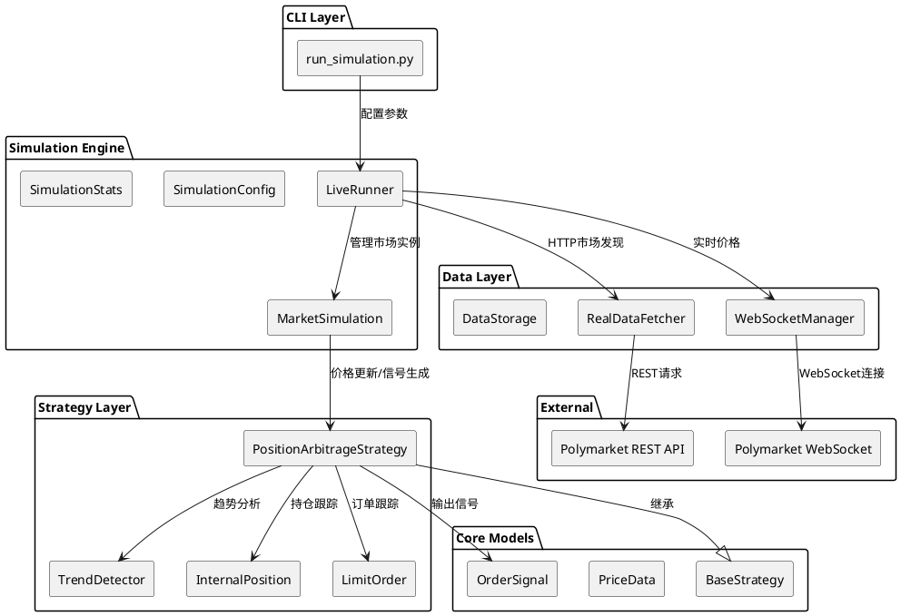
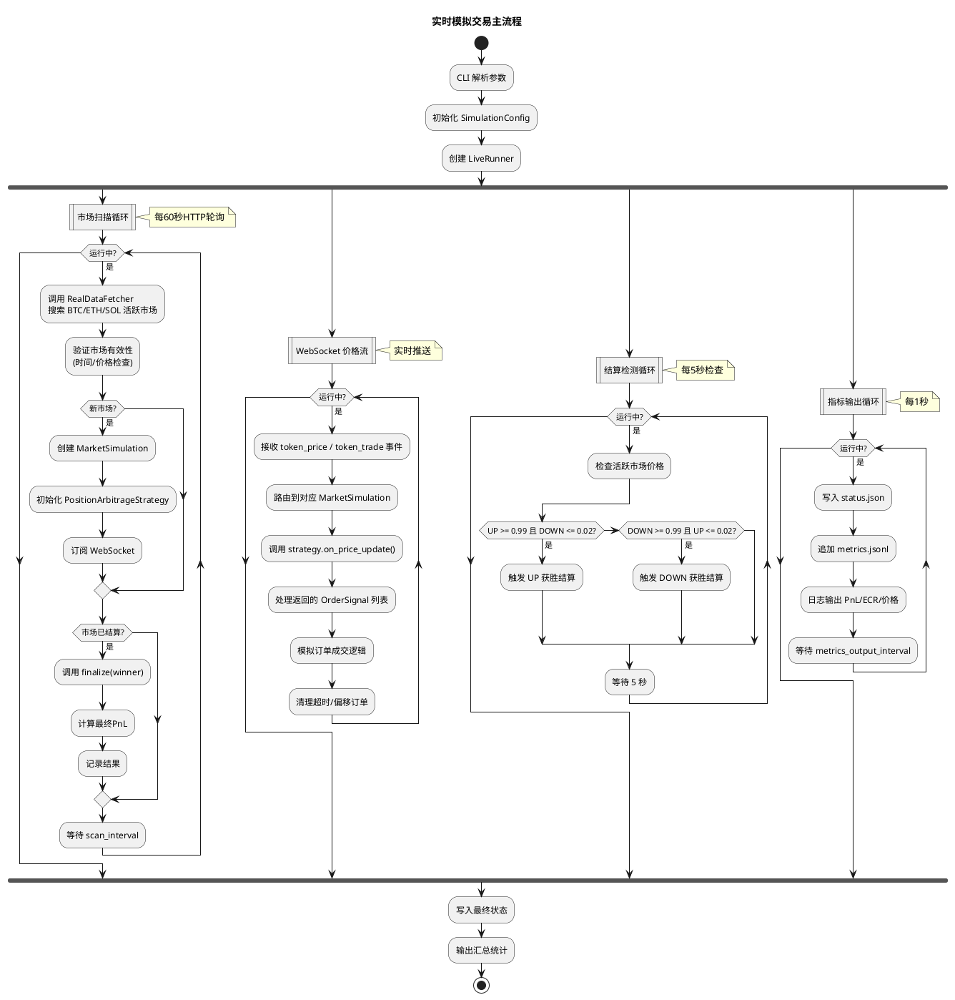
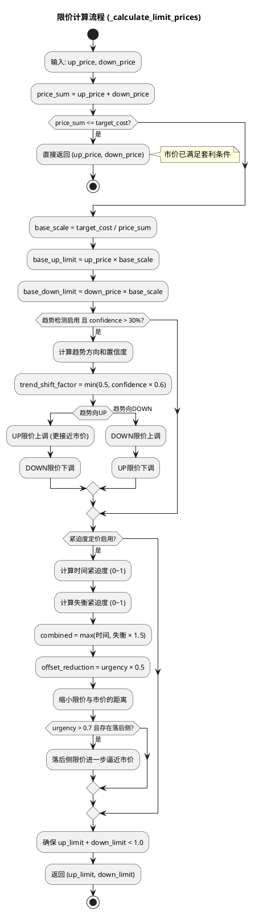
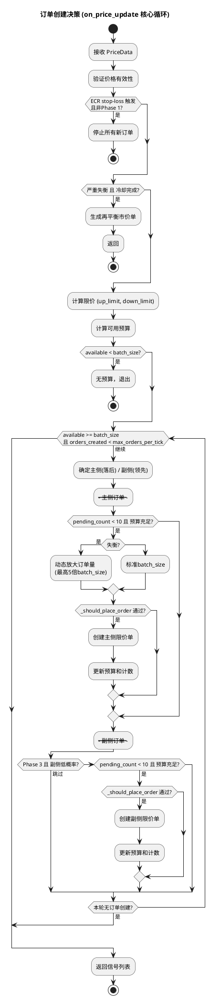
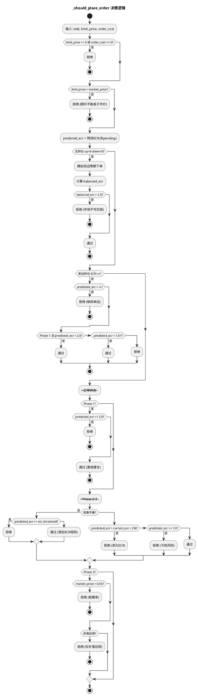
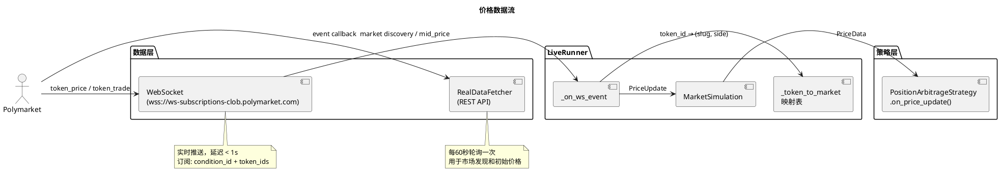
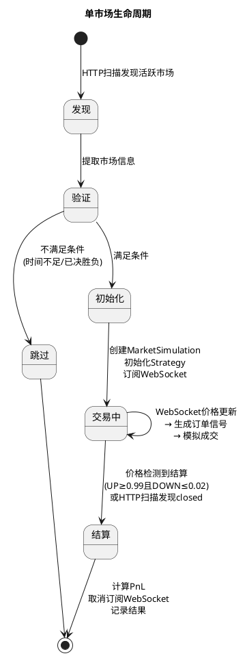
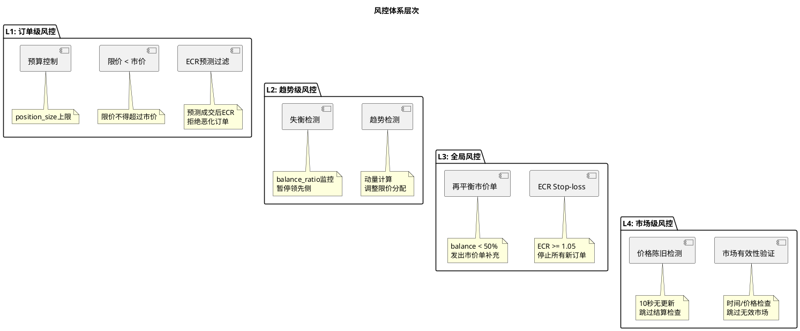

# Position Arbitrage 策略分析报告

**项目**: PolyMoney  
**策略**: Position Arbitrage (position-arbitrage)  
**报告日期**: 2026-02-10  
**版本**: v1.0  

---

## 目录

1. [策略核心原理](#1-策略核心原理)
2. [系统架构概览](#2-系统架构概览)
3. [策略详细机制](#3-策略详细机制)
4. [模拟交易系统机制](#4-模拟交易系统机制)
5. [订单成交模拟机制](#5-订单成交模拟机制)
6. [风控体系](#6-风控体系)
7. [发现的问题](#7-发现的问题)
8. [优化建议](#8-优化建议)
9. [结论](#9-结论)

---

## 1. 策略核心原理

### 1.1 Polymarket 二元市场结构

Polymarket 的 15 分钟 UP/DOWN 市场是一种二元期权结构：

- 每个市场有两个 Token：**UP** 和 **DOWN**
- 市场结算时，获胜方 Token 价值 = **$1.00**，失败方 Token 价值 = **$0.00**
- 在任意时刻，`UP_price + DOWN_price ≈ $1.00`（由做市商维持）

### 1.2 套利基本原理

**核心不等式**：若同时持有 UP 和 DOWN Token，且 `总成本 < min(UP_shares, DOWN_shares)`，则无论结果如何均可盈利。

定义 **有效成本率（ECR, Effective Cost Rate）**：

$$
ECR = \frac{UP_{cost} + DOWN_{cost}}{\min(UP_{shares}, DOWN_{shares})}
$$

- **ECR < 1.0**：无论哪方获胜，均保证盈利（套利成功）
- **ECR = 1.0**：盈亏平衡
- **ECR > 1.0**：存在亏损风险

### 1.3 通过限价单实现低成本买入

市场价格之和 ≈ 1.0，直接按市价同时买入两侧不可能获利。策略通过**限价单**以低于市价的价格挂单买入：

$$
UP_{limit} + DOWN_{limit} = target\_cost < 1.0
$$

默认 `target_cost = 0.98`，即两侧限价之和 = 98%，理论利润空间 = 2%。

```
示例：市场价 UP=0.60, DOWN=0.40
      scale = 0.98 / 1.00 = 0.98
      UP_limit = 0.60 × 0.98 = 0.588
      DOWN_limit = 0.40 × 0.98 = 0.392
      合计 = 0.98 < 1.00 → 套利空间存在
```

---

## 2. 系统架构概览

### 2.1 整体架构图



### 2.2 运行时流程图



---

## 3. 策略详细机制

### 3.1 三阶段交易模型

策略将每个市场的生命周期划分为三个阶段：

| 阶段 | 时间区间 | 行为特征 | ECR容忍度 |
|------|---------|---------|----------|
| Phase 1（激进建仓） | 0 ~ 300s（前5分钟） | 双边同时下单，允许ECR恶化至200% | 极宽松（2.0） |
| Phase 2（稳健优化） | 300s ~ 600s | 双边下单但严格ECR保护 | 严格（当前ECR + 2%） |
| Phase 3（收尾聚焦） | 600s ~ 结算 | 仅补充落后侧，跳过低概率Token | 严格（< 1.0） |

### 3.2 限价计算机制



### 3.3 订单决策机制

每次价格更新时，策略在一个循环中尝试创建最多 `max_orders_per_tick`（默认4）个订单：



### 3.4 ECR 预测与订单过滤

`_should_place_order` 是策略的核心风控守门函数：



### 3.5 动态订单量计算

当持仓失衡时，落后侧订单量会动态放大：

```
标准量: batch_size (默认 $1.0)
失衡放大: min(5 × batch_size, gap_shares × limit_price)

示例: UP=80 shares, DOWN=50 shares, batch_size=$1.0, limit_price=0.40
      gap = 30 shares, desired_cost = 30 × 0.40 = $12.0
      scale = min(5, 12/1) = 5.0
      order_cost = $1.0 × 5 = $5.0
```

---

## 4. 模拟交易系统机制

### 4.1 市场发现

LiveRunner 通过两个通道获取市场信息：

1. **HTTP 轮询**（`_market_scan_loop`）：每 60 秒调用 `RealDataFetcher.find_multi_coin_markets()`，搜索 BTC/ETH/SOL 的 15 分钟 UP/DOWN 市场
2. **市场有效性验证**：
   - 距结算 > `min_trading_time`（300s）
   - 最低价格 > `min_price_threshold`（5%），排除已决胜负的市场

### 4.2 价格获取



### 4.3 市场生命周期



---

## 5. 订单成交模拟机制

### 5.1 成交模型

模拟采用**简化的价差模型**进行限价单成交判断：

```
spread_tolerance = 1% (固定)

提交时即时判断:
  1. target_price >= market_price → 立即以市价成交
  2. (market_price - target_price) / market_price <= 1% → 以限价成交
  3. 否则 → 进入pending队列等待

Pending订单每次价格更新时检查:
  1. market_price <= limit_price → 以市价成交
  2. 价差 <= 1% → 以限价成交
  3. 价差 > 5% (stale_order_threshold) → 撤单
  4. 挂单时间 > 30s (order_timeout) → 超时撤单
  5. 否则 → 继续等待
```

### 5.2 双重持仓跟踪

系统维护两套独立的持仓记录，需要同步：

| 记录位置 | 类型 | 用途 |
|---------|------|------|
| `MarketSimulation.result` | MarketResult | 最终结算用，记录实际成交 |
| `Strategy.up_position / down_position` | InternalPosition | 策略决策用，计算ECR |
| `Strategy.pending_orders` | List[LimitOrder] | 策略预算计算用 |
| `MarketSimulation.pending_orders` | List[Dict] | 成交模拟引擎用 |

成交时需同步更新这四个位置。撤单时需同步清理 Strategy 和 MarketSimulation 两侧的 pending 记录。

### 5.3 Ghost Order 同步机制

由于撤单和成交时按 side + price/size 模糊匹配策略 pending_orders，可能出现匹配失败导致"幽灵订单"，永久占用预算。系统通过 `_sync_pending_orders` 方法在每次价格更新后强制同步：

```python
# 统计 Runner 侧实际 pending 数量
# 与 Strategy 侧 pending 数量比对
# 若 Strategy 侧多出，则裁剪至与 Runner 一致（保留最新的）
```

---

## 6. 风控体系

### 6.1 风控层次总览



### 6.2 趋势检测器

基于滑动窗口的动量计算：

```
momentum = (price_current - price_N_ago) / price_N_ago
confidence = min(1.0, |momentum| / max_momentum_threshold)
```

| 参数 | 默认值 | 说明 |
|------|--------|------|
| momentum_window | 5 | 动量计算回溯窗口 |
| max_momentum_threshold | 0.10 | 达到100%置信度的动量值 |
| trend_stop_threshold | 0.70 | 暂停反向订单的置信度阈值 |

**作用方式**：
- **限价调整**：趋势方向的限价上调（更接近市价以提高成交率），反向限价下调
- **订单过滤**：当失衡 > 10% 时，领先侧订单需趋势方向一致才允许通过

### 6.3 紧迫度定价

综合时间和失衡两个维度计算紧迫度，动态缩小限价与市价的距离：

```
time_urgency = elapsed / market_duration          (0→1)
imbalance_urgency = 1 - balance_ratio             (0→1)
combined = max(time_urgency, imbalance_urgency × 1.5)
offset_reduction = combined × urgency_price_factor (×0.5)

新限价 = 旧限价 + (市价 - 旧限价) × offset_reduction
```

当 urgency > 0.7 时，落后侧限价进一步上调至 `min(市价 × 0.995, 当前限价 + 差距 × 0.5)`。

---

## 7. 发现的问题及修复状态

> **全部 10 个问题已修复**。以下保留原始问题描述，并在每个问题后标注修复方案。

### 问题 1: 成交模型过于理想化 — **已修复**

**严重程度**: 高

**原问题**: 模拟成交使用固定 1% 价差容忍度，假设只要限价在市价 1% 以内即可成交。这与真实 Polymarket CLOB（中央限价订单簿）的成交机制有本质差异：
- 真实市场需要对手方挂单才能成交
- 流动性不足时大单会产生滑点
- 市场深度（订单簿厚度）完全未建模
- 1% 的价差假设在低流动性市场可能过于乐观

**修复**: 在 `MarketSimulation` 中引入动态价差模型 `_get_effective_spread()`：
- 使用 WebSocket 推送的真实 bid/ask 价差数据计算动态 spread_tolerance
- 当无价差数据时回退到保守的 2% 默认值（而非之前的 1%）
- 新增 size-based slippage: 每 $10 订单增加 0.1% 滑点（上限 0.5%）
- 跟踪 `last_up_spread` / `last_down_spread` 用于每侧独立的价差判断

### 问题 2: batch_size 默认值不一致 — **已修复**

**严重程度**: 中

**原问题**: `run_simulation.py` live 命令的 `--batch-size` 参数 help 文本写着 `default: 10.0`，但实际 `default=1.0`。Backtest 模式硬编码 `batch_size=5.0`，与 live 模式的默认值 `1.0` 不一致。

**修复**: 统一所有模式的 `batch_size` 默认值为 `5.0`：
- `run_simulation.py` CLI: `--batch-size default=5.0, help="default: 5.0"`
- `run_live_simulation()` 函数签名: `batch_size=5.0`
- `SimulationConfig`: `batch_size=5.0`
- Backtest 和 Live 使用相同的默认值

### 问题 3: Phase 1 ECR 容忍度过高 — **已修复**

**严重程度**: 高

**原问题**: Phase 1 允许 ECR 恶化到 2.0（100% 潜在亏损），导致 Phase 1 结束时可能 ECR 过高无法恢复。

**修复**: 新增 `_get_phase1_ecr_limit()` 方法实现渐进式衰减：
```
ECR_limit = 1.5 - 0.4 × (elapsed / phase1_end)    // 1.5 → 1.1
```
- Phase 1 起始允许 ECR 到 1.5（50% 最大亏损，而非之前的 100%）
- 线性衰减到 Phase 1 结束时仅允许 1.1（10% 最大亏损）
- 替换了所有 4 处硬编码 `2.0` 阈值

### 问题 4: 双重 Pending Order 跟踪的同步脆弱性 — **已修复**

**严重程度**: 中

**原问题**: 通过 side + price/size 模糊匹配同步两套 pending_orders，可能匹配错误。

**修复**: 引入全局唯一订单 ID 系统：
- `MarketSimulation._next_order_id` 计数器，生成 `{slug}_{side}_{id}` 格式唯一 ID
- `_link_order_id()` 方法将 runner ID 同步到策略的 LimitOrder.order_id
- `_execute_fill()` 和 `_cancel_pending_order()` 优先按 order_id 精确匹配
- 保留 side+price 模糊匹配作为向后兼容的 fallback

### 问题 5: 趋势检测基于价格更新频率而非时间 — **已修复**

**严重程度**: 中

**原问题**: TrendDetector 使用事件计数窗口（`window_size=5`），WebSocket 推送频率不固定导致时间尺度不稳定。

**修复**: 重写 TrendDetector 为时间窗口模型：
- `window_seconds=30.0`（默认 30 秒时间窗口）
- 价格历史存储为 `(timestamp, price)` 元组
- `get_momentum()` 查找时间窗口起始点的价格计算动量
- 自动裁剪 2 倍窗口外的历史数据控制内存
- 需至少半个窗口的数据才返回有效动量值
- `on_price_update()` 传递 `price_data.timestamp` 给检测器

### 问题 6: 结算检测可能误判 — **已修复**

**严重程度**: 中

**原问题**: 价格短暂触及结算阈值后回撤可能导致提前误判结算，无多次确认机制。

**修复**: 在 `_settlement_check_loop` 中实现多次确认机制：
- `_settlement_confirmations: Dict[str, int]` 追踪每个市场的连续确认次数
- 默认要求连续 3 次检查（每次间隔 5 秒 = 总计 15 秒）满足条件才触发结算
- 若某次检查不满足条件，计数器重置为 0
- 自动清理已不在活跃列表中的过期确认记录

### 问题 7: 再平衡市价单缺少 ECR 检查 — **已修复**

**严重程度**: 高

**原问题**: `_generate_rebalancing_order` 生成的市价单不经过 ECR 预测检查，可能将 ECR 推过阈值。

**修复**: 在 `_generate_rebalancing_order` 返回信号前增加 ECR 预测检查：
```python
projected_ecr = self.calculate_projected_ecr(underweight_side, shares_needed, order_price)
if projected_ecr > 0 and projected_ecr >= self.ecr_threshold:
    logger.warning(f"REBALANCING REJECTED: would push ECR to {projected_ecr:.2%}")
    return None
```
- 同时在日志中输出 projected ECR 以便监控

### 问题 8: 无资金管理和跨市场风控 — **已修复**

**严重程度**: 中

**原问题**: 多市场并行时无总体风险约束，总暴露 = N × position_size。

**修复**: 在 SimulationConfig 和 LiveRunner 中增加全局风控：
- `SimulationConfig.max_concurrent_markets = 6` （最大并行市场数）
- `SimulationConfig.max_total_exposure = 500.0` （总暴露上限 $500）
- `LiveRunner._get_total_exposure()` 计算所有活跃市场总成本
- `LiveRunner._can_start_new_market()` 在启动新市场前检查两个限制
- `_start_market_simulation()` 在超限时跳过并记录日志

### 问题 9: market_duration 与实际市场时长不匹配 — **已修复**

**严重程度**: 低

**原问题**: `_calculate_time_urgency` 从策略启动时间开始计算，而非市场实际结算时间。

**修复**: 
- 策略新增 `market_settlement_time: Optional[float]` 属性
- `on_market_start()` 从 `market_info["settlement_time"]` 获取实际结算时间
- `_calculate_time_urgency()` 优先使用 `(now - start) / (settlement - start)` 计算
- LiveRunner 的 `_start_market_simulation()` 在 market_info 中传递 settlement_time
- 无 settlement_time 时回退到原始 market_duration 估算

### 问题 10: 回测和实盘模式参数差异 — **已修复**

**严重程度**: 中

**原问题**: Backtest 关闭 rebalancing，batch_size=5.0 vs Live 的 1.0，配置不可比。

**修复**: 统一两种模式的默认参数：
- Backtest: `enable_rebalancing=True`（之前为 False）
- Backtest: 新增 `enable_trend_detection=True, enable_urgency_pricing=True`
- Live 和 Backtest 的 batch_size 统一为 `5.0`
- 两种模式使用完全相同的策略特性开关

---

## 8. 修复实施摘要

### 8.1 修改文件清单

| 文件 | 修改量 | 涉及问题 |
|------|--------|---------|
| `polymoney/strategy/builtin/position_arbitrage.py` | +99/-40 行 | #3, #5, #7, #9 |
| `polymoney/simulation/live_runner.py` | +160/-20 行 (第一轮) +402/-77 行 (第二轮) | #1, #4, #6, #8, #9, 深度成交 |
| `scripts/run_simulation.py` | +8/-4 行 (第一轮) +50/-27 行 (第二轮) | #2, #10, YAML 配置 |
| `polymoney/data/websocket_client.py` | +14 行 (第二轮) | token_orderbook 事件 |
| `polymoney/config.py` | 新增 ~230 行 (第二轮) | 配置加载器 |
| `config/strategy_defaults.yaml` | 新增 ~130 行 (第二轮) | 全量参数配置 |

### 8.2 新增/修改的关键方法

| 方法 | 文件 | 说明 |
|------|------|------|
| `_get_phase1_ecr_limit()` | position_arbitrage.py | 渐进式 Phase 1 ECR 容忍度 (1.5→1.1) |
| `TrendDetector` (重写) | position_arbitrage.py | 时间窗口模型替代事件计数 |
| `_calculate_time_urgency()` (增强) | position_arbitrage.py | 支持实际结算时间 |
| `_generate_rebalancing_order()` (增强) | position_arbitrage.py | ECR 预测检查 |
| `_get_effective_spread()` | live_runner.py | 动态价差模型 |
| `_link_order_id()` | live_runner.py | 唯一订单 ID 链接 |
| `_can_start_new_market()` | live_runner.py | 全局风控检查 |
| `_get_total_exposure()` | live_runner.py | 跨市场总暴露计算 |
| `_settlement_check_loop()` (重写) | live_runner.py | 多次确认机制 |

### 8.3 新增配置参数

| 参数 | 默认值 | 文件 | 说明 |
|------|--------|------|------|
| `momentum_window_seconds` | 30.0 | position_arbitrage.py | 趋势检测时间窗口 |
| `market_settlement_time` | None | position_arbitrage.py | 市场结算时间戳 |
| `max_concurrent_markets` | 6 | live_runner.py | 最大并行市场数 |
| `max_total_exposure` | 500.0 | live_runner.py | 总暴露上限 ($) |

---

## 9. 结论

### 9.1 策略评估

Position Arbitrage 策略基于 Polymarket 二元市场的结构性套利机会，核心逻辑正确且清晰：通过限价单使两侧总成本 < $1 实现无风险利润。策略配备了较为完善的风控体系（ECR 监控、趋势检测、紧迫度定价、再平衡机制），代码结构清晰，参数可配置性强。

### 9.2 已修复的关键风险

1. **成交模型偏差**：已引入动态价差和滑点模型，降低模拟与实盘的系统性偏差。**[二次优化已完成]** 进一步接入实时 orderbook API 深度模拟，支持按订单簿逐档成交、部分成交、流动性不足回退。
2. **ECR 失控风险**：Phase 1 渐进式容忍度 + 再平衡 ECR 检查，堵住了两个风控漏洞。
3. **参数一致性**：回测与实盘使用统一的默认参数，回测结果可直接指导实盘预期。
4. **订单同步**：唯一 ID 匹配消除了幽灵订单和模糊匹配导致的预算泄漏。
5. **全局风控**：跨市场总暴露限额防止资金过度集中。
6. **参数外置**：**[已完成]** 所有策略/模拟/风控参数已提取到 `config/strategy_defaults.yaml`，支持 `--config` 参数指定配置文件，CLI 参数可覆盖 YAML 默认值。

### 9.3 残余风险与后续建议

| 方向 | 建议 | 优先级 |
|------|------|--------|
| ~~成交模型~~ | ~~接入实时 orderbook API 做更精确的深度模拟~~ — **已完成** | ~~P1~~ |
| 滑点校验 | 对比模拟成交价与实际成交记录，计算模型偏差 | P1 |
| ~~参数外置~~ | ~~将策略/模拟参数提取到 YAML 配置文件~~ — **已完成** | ~~P2~~ |
| ~~再平衡日志刷屏~~ | ~~再平衡拒绝后增加冷却时间~~ — **已完成** (§11.2 Fix 1) | ~~P0~~ |
| ~~单边仓位风险~~ | ~~严重偏斜市场中暂停新限价单~~ — **已完成** (§11.2 Fix 2) | ~~P0~~ |
| 回测验证 | 用修复后的统一参数重新跑多市场回测，确认胜率和ECR改善 | P0 |

---

## 10. 第二轮优化实施摘要

### 10.1 成交模型优化 — Orderbook 深度模拟

**目标**：将原有简单价差模型升级为基于真实订单簿深度的成交模拟。

**实现方案**：

1. **`OrderbookSnapshot` 数据结构** (`live_runner.py`)
   - 缓存每个 token 的完整 bids/asks 层级 `(price, size)` 列表
   - `simulate_buy_fill(size, limit_price)` 逐档遍历 ask 侧模拟成交
   - 支持部分成交（partial fill）：当订单簿流动性不足时，已填部分立即成交，剩余转为 pending
   - `from_raw()` 工厂方法兼容 CLOB API 和 WebSocket 两种数据格式

2. **数据源（三层降级）**
   - **优先级 1**: WebSocket `token_orderbook` 事件实时推送完整订单簿
   - **优先级 2**: HTTP `get_orderbook()` 每 15 秒轮询补缺（当 WS 数据缺失或过期时）
   - **优先级 3**: 原有 spread + slippage 简单模型（无任何订单簿数据时的最终兜底）

3. **WebSocket 改动** (`websocket_client.py`)
   - `_handle_orderbook_snapshot` 和 `_process_single_orderbook` 新增 `token_orderbook` 事件发射
   - 携带完整 `bids`/`asks` 原始数据供 LiveRunner 解析

4. **LiveRunner 集成**
   - `_on_ws_event` 处理 `token_orderbook` 事件，解析并缓存到 `MarketSimulation`
   - `_orderbook_refresh_loop` 后台循环：每 15s HTTP 轮询补充过期/缺失的 orderbook
   - `_start_market_simulation` 启动时通过 HTTP 拉取初始 orderbook 快照

5. **成交判定流程（新）**

```
_simulate_fill_with_depth(side, size, limit_price, market_price)
│
├── 有有效 OrderbookSnapshot?
│   ├── YES → simulate_buy_fill() 逐档 ask 遍历
│   │   ├── 全部成交 → return (avg_price, size)
│   │   ├── 部分成交 → return (avg_price, filled_size)
│   │   └── 无档位可成交 → return None (→ pending)
│   │
│   └── NO → 降级到简单模型
│       ├── limit >= market → 市价成交 + size_slippage
│       ├── price_diff <= spread → 限价成交
│       └── 否则 → return None (→ pending)
```

### 10.2 参数外置 — YAML 配置系统

**目标**：消除策略/模拟参数的硬编码，支持配置文件化管理。

**实现方案**：

1. **`config/strategy_defaults.yaml`** — 全量参数配置文件
   - 6 个参数组：`strategy`、`risk`、`trend_detection`、`urgency_pricing`、`simulation`、`fund_management`
   - 每个参数附带注释说明

2. **`polymoney/config.py`** — 配置加载器
   - `StrategyConfig.from_yaml(path)` 从文件加载
   - `StrategyConfig.from_defaults()` 加载默认配置（`config/strategy_defaults.yaml`）
   - `get_strategy_params(**overrides)` 构建策略参数字典，支持 CLI 覆盖
   - `to_simulation_config(**overrides)` 构建 `SimulationConfig`，支持 CLI 覆盖
   - 分层优先级：**CLI 参数 > YAML 配置 > 代码内置默认值**

3. **`run_simulation.py` CLI 集成**
   - 新增 `--config / -c` 全局参数
   - 无指定时自动尝试加载 `config/strategy_defaults.yaml`
   - backtest 和 live 模式均支持 YAML + CLI 混合配置

### 10.3 修改文件清单

| 文件 | 修改量 | 说明 |
|------|--------|------|
| `polymoney/simulation/live_runner.py` | +402/-77 行 | OrderbookSnapshot、深度成交模型、orderbook 刷新循环 |
| `polymoney/data/websocket_client.py` | +14 行 | token_orderbook 事件发射 |
| `scripts/run_simulation.py` | +50/-27 行 | --config 参数、YAML 加载集成 |
| `polymoney/config.py` | 新增 ~230 行 | 配置加载器 |
| `config/strategy_defaults.yaml` | 新增 ~130 行 | 全量默认参数配置 |

### 10.4 新增/修改的关键方法

| 方法 | 文件 | 说明 |
|------|------|------|
| `OrderbookSnapshot` (新增) | live_runner.py | 订单簿快照缓存与深度成交模拟 |
| `OrderbookSnapshot.simulate_buy_fill()` | live_runner.py | 逐档遍历 ask 侧计算均价和成交量 |
| `OrderbookSnapshot.from_raw()` | live_runner.py | 兼容 dict/list 两种层级格式 |
| `_simulate_fill_with_depth()` | live_runner.py | 深度成交 + 简单模型降级 |
| `_orderbook_refresh_loop()` | live_runner.py | HTTP 定期拉取 orderbook 补缺 |
| `update_orderbook()` | live_runner.py | 更新 MarketSimulation orderbook 缓存 |
| `StrategyConfig` (新增) | config.py | YAML 配置加载与参数构建 |
| `load_config()` | config.py | 加载默认或指定路径配置 |

---

## 11. 第三轮修复实施摘要 — 实盘模拟问题修复

### 11.1 问题来源

通过 live simulation 实盘模拟发现以下三个关键问题：

| 问题 | 表现 | 根因 |
|------|------|------|
| 再平衡拒绝日志刷屏 | ETH 市场在数秒内产生数千条 `REBALANCING REJECTED` 日志 | 再平衡被 ECR 检查拒绝后未设置冷却时间，`can_rebalance()` 在下一个价格 tick 立即返回 True，导致无限重试 |
| 单边仓位导致 -100% 亏损 | BTC/SOL 市场只买入便宜侧（UP），昂贵侧（DOWN）限价单永远未成交 | 严重偏斜市场（如 UP=90%/DOWN=10%）中，按比例缩放的限价远低于市场价，昂贵侧订单无法成交，导致完全暴露的单边风险 |
| Ghost Orders / 幽灵订单 | 大量 `"Failed to find matching strategy pending order"` 和 `"Sync: removed X ghost pending orders"` 警告 | 策略内部 pending_orders 与 LiveRunner 跟踪的订单不同步，已过期/取消的订单未正确清理 |

### 11.2 修复方案

#### Fix 1: 再平衡拒绝冷却（Rebalancing Rejection Cooldown）

**位置**: `polymoney/strategy/builtin/position_arbitrage.py`

**改动**：
- 新增 `_last_rebalancing_rejection_time` 属性，记录最近一次再平衡被拒绝的时间
- `can_rebalance()` 从仅检查执行冷却，改为**同时检查执行冷却和拒绝冷却**
- 当 `_generate_rebalancing_order()` 因 ECR 超阈值而拒绝时，立即设置拒绝时间戳
- `reset()` 方法中一并重置

**效果**：再平衡被拒绝后，进入与执行相同的冷却期（默认 30s），彻底消除日志刷屏。

#### Fix 2: 市场偏斜保护（Market Skew Guard）

**位置**: `polymoney/strategy/builtin/position_arbitrage.py`

**改动**：
- 新增 `max_skew_threshold` 参数（默认 0.85），可通过 YAML 配置
- 在 `on_price_update()` 的限价单生成前新增偏斜检查：
  - 若 `max(up_price, down_price) > max_skew_threshold`，跳过所有新限价单
  - 已有仓位的再平衡市价单不受影响（在偏斜检查之前处理）
  - 使用 `_skew_rejection_logged` 标志避免重复日志
  - 当市场回归正常范围时自动重置，恢复下单

**效果**：在严重偏斜市场中（如一侧 > 85%），策略不再尝试建仓，避免了只买入便宜侧导致的单边暴露和 -100% 亏损。

#### 配置系统集成

| 文件 | 修改 |
|------|------|
| `config/strategy_defaults.yaml` | 新增 `risk.max_skew_threshold: 0.85` |
| `polymoney/config.py` | `get_strategy_params()` 新增 `max_skew_threshold` 字段 |

### 11.3 改动后限价单生成流程

```
on_price_update(price_data)
│
├── 价格合法性验证 (price > 0, sum ≈ 1.0)
├── 趋势检测更新
├── 风险状态 + ECR 止损检查
│
├── 再平衡检查 (仅已有双边仓位 + 严重失衡)
│   ├── can_rebalance() → 检查 执行冷却 AND 拒绝冷却  ← 新增
│   │   └── 冷却期内 → 跳过
│   └── _generate_rebalancing_order()
│       ├── ECR 检查通过 → 生成市价单 + 更新 _last_rebalancing_time
│       └── ECR 检查失败 → 更新 _last_rebalancing_rejection_time  ← 新增
│
├── ★ 偏斜保护 ← 新增
│   └── max(up_price, down_price) > max_skew_threshold?
│       ├── YES → 记录日志 + return (不生成新限价单)
│       └── NO → 继续
│
├── 计算限价
├── 预算检查
└── 循环生成限价单 (primary + secondary)
```

---

## 12. 第四轮修复实施摘要 — 实盘模拟二次验证

### 12.1 上轮修复效果评估

| 修复项 | 结果 | 评价 |
|--------|------|------|
| 再平衡拒绝冷却 | `REBALANCING REJECTED` 从数千条降至 5 条 | **完全生效** |
| 偏斜保护 | SOL 市场 (UP>85%) 触发保护暂停下单 | **逻辑正确，有日志 bug** |

### 12.2 新发现的问题

| 问题 | 表现 | 根因 |
|------|------|------|
| SKEW GUARD 日志重复 | SOL 偏斜保护在 3 分钟内输出 134 条 | 偏斜阈值 85% 边缘振荡：价格在 84%-86% 来回波动，flag 反复 reset → 反复触发 |
| Ghost Orders 持续大量 | 30 次 ghost sync 清理 | `_link_order_id` 对同价格同侧的多个订单重复链接同一个 strategy pending order |
| BTC ECR=244% | 只有 UP 侧成交，DOWN 限价远低于市价被持续取消 | 市场从 50/50 快速趋势到 77/23，策略持续为超重侧下单无保护 |

### 12.3 修复方案

#### Fix 3: SKEW GUARD 迟滞带（Hysteresis Band）

**原理**：加入 5% 迟滞带，偏斜激活阈值 85%，解除阈值 80%。价格在 80%-85% 之间时维持当前状态不切换。

**改动** (`position_arbitrage.py`)：
- 激活条件：`max_price > 85%` 或 `(已激活 AND max_price > 80%)`
- 解除条件：`max_price ≤ 80%`
- 解除时输出一条恢复日志

#### Fix 4: 订单链接去重（Order ID Deduplication）

**根因**：`_link_order_id` 在策略同一 tick 产出多个同价同侧订单时，反复覆盖同一个 strategy pending order 的 ID，导致其他订单无法被 runner 匹配。

**改动** (`live_runner.py`)：
- `_link_order_id` 增加检查：跳过 `order_id` 中已包含 `self.slug` 前缀的订单（已被 runner 链接）
- 确保每个 strategy pending order 只被链接一次

#### Fix 5: 仓位失衡护卫（Imbalance Guard）

**原理**：当超重侧仓位 > 3 倍于欠重侧时，拒绝为超重侧下新单。

**改动** (`position_arbitrage.py` `_should_place_order`)：
- 计算 `imbalance_ratio = max_shares / min_shares`
- 当 `ratio > 3.0` 且 `side == overweight_side` 时返回 False
- 仅在双侧均有仓位时生效

### 12.4 完整订单保护层级（修复后）

```
价格到达 → on_price_update()
│
├── Layer 1: 价格有效性 (sum ≈ 1.0, price > 0)
├── Layer 2: ECR 止损 (ECR > threshold → 停止下单)
├── Layer 3: 再平衡检查 (with cooldown on both execution & rejection)
├── Layer 4: 市场偏斜保护 (max_price > 85%, 5% hysteresis)
├── Layer 5: 预算检查 (available < batch_size)
│
└── 循环生成限价单
    ├── Layer 6: _should_place_order()
    │   ├── 仓位失衡护卫 (overweight > 3x → block)     ← 新增
    │   ├── ECR 预测检查 (predicted ECR > threshold)
    │   ├── Phase 3 低概率过滤
    │   └── Phase 3 聚焦滞后侧
    └── _create_signal() → signal
```

### 12.5 改动文件清单

| 文件 | 修改 | 说明 |
|------|------|------|
| `polymoney/strategy/builtin/position_arbitrage.py` | +30 行 | 迟滞带、仓位失衡护卫 |
| `polymoney/simulation/live_runner.py` | +6 行 | 订单链接去重 |

---

## 13. 第五轮优化实施摘要

> **目标**: 根据第四轮修复后的模拟运行结果进一步优化，解决 ECR 仍 >1.0 的根本原因，  
> 同时修复 WebSocket 代理连接 EOF 崩溃。

### 13.1 WebSocket 代理连接 EOF 崩溃修复

**问题**: 模拟运行中频繁出现 `Fatal error: protocol.eof_received() call failed`，堆栈指向 `websockets` 库 `HTTPProxyConnection` 在 `eof_received()` 中访问 `None.status_code`。虽然不影响数据流（重连机制会恢复），但大量错误日志干扰监控。

**根因**: `websockets` 库在通过 HTTP 代理连接时，若代理意外断开，`eof_received()` 在 `response` 为 `None` 时试图读取 `status_code`，触发 `AttributeError`。随后级联产生 `EOFError: stream ended`。

**修复**:

```
websocket_client.py: _handle_loop_exception()
│
├── 原有：仅抑制 "recv_messages" AttributeError
│
├── 新增：抑制 "status_code" AttributeError（代理连接 EOF）
├── 新增：抑制 EOFError "stream ended"（级联 EOF）
└── 新增：_run_subscription() 中捕获 (EOFError, OSError) 为网络级错误
```

### 13.2 移除 Phase 1 ECR 止损豁免

**问题**: Phase 1（前 5 分钟）"激进建仓"模式绕过 ECR 止损，在趋势市场中导致策略不断单边买入，快速积累高 ECR 亏损仓位。

**修复**: ECR 止损现在 **适用于所有阶段**，包括 Phase 1。Phase 1 不再获得任何特殊豁免。
- 偏斜保护（Layer 4）和仓位失衡护卫（Layer 6）已经提供了足够的防御
- Phase 1 的"激进性"现在仅体现在 urgency pricing 的价格偏移上

### 13.3 固定订单尺寸（移除动态倍增）

**问题**: 当检测到仓位不平衡时，dynamic sizing 将订单尺寸放大至 `batch_size × 5`（最高 $10），这些大额追赶订单在快速市场中极易变为 stale 订单，白白消耗预算窗口且放大损失。

**修复**: 移除动态倍增逻辑，所有订单统一使用 `batch_size`（$2.0）。通过高频小额交易控制风险，而非低频大额追赶。

### 13.4 降低每 tick 订单数

**问题**: `max_orders_per_tick = 4` 在快速波动市场中一次产生 4 单，大部分在下一个 tick 就因价格漂移被取消为 stale。

**修复**: 默认值从 4 降至 2。减少无效订单生成，降低 stale 比率。

### 13.5 收紧市场进入条件

**问题**: 策略进入已明显偏斜（如 UP=70%, DOWN=30%）的市场时，从一开始就只能有效成交便宜一侧的订单，导致仓位天然不平衡。

**修复**: 在 `LiveRunner._is_market_valid()` 中新增入场偏斜过滤：
- 新参数 `max_entry_skew = 0.65`
- 当 `max(up_price, down_price) > 65%` 时拒绝进入该市场
- 仅影响入场判断，已在交易中的市场不受影响（已有 skew guard 覆盖）

### 13.6 放宽 Stale Order 阈值

**问题**: `stale_order_threshold = 5%` 在波动市场中导致大量有效订单被过早取消。价格在 ±5% 范围内的正常波动会触发误杀。

**修复**: 阈值从 5% 提升至 8%，给订单更多成交机会。

### 13.7 完整订单保护层级（第五轮修复后）

```
市场扫描 → _is_market_valid()
│
├── Layer 0: 入场偏斜过滤 (max_price > 65% → 拒绝进入)     ← 新增
├── 时间剩余检查 (< 5min → 跳过)
└── 结果已决检查 (min_price < 5% → 跳过)

价格到达 → on_price_update()
│
├── Layer 1: 价格有效性 (sum ≈ 1.0, price > 0)
├── Layer 2: ECR 止损 (所有阶段, ECR > threshold → 停止)   ← 不再豁免 Phase 1
├── Layer 3: 再平衡检查 (with cooldown on execution & rejection)
├── Layer 4: 市场偏斜保护 (max_price > 85%, 5% hysteresis)
├── Layer 5: 预算检查 (available < batch_size)
│
└── 循环生成限价单 (max 2 per tick)                          ← 从 4 降至 2
    ├── Layer 6: _should_place_order()
    │   ├── 仓位失衡护卫 (overweight > 3x → block)
    │   ├── ECR 预测检查 (predicted ECR > threshold)
    │   ├── Phase 3 低概率过滤
    │   └── Phase 3 聚焦滞后侧
    ├── 固定尺寸 batch_size = $2.0                           ← 移除动态倍增
    └── _create_signal() → signal

订单管理 (LiveRunner._check_fills)
│
├── stale 阈值 = 8%                                          ← 从 5% 放宽
└── 超时 = 30s
```

### 13.8 改动文件清单

| 文件 | 修改 | 说明 |
|------|------|------|
| `polymoney/data/websocket_client.py` | +14 行 | 抑制代理 EOF 崩溃 |
| `polymoney/strategy/builtin/position_arbitrage.py` | -16/+12 行 | 移除 Phase 1 豁免、动态倍增、降低 tick 订单数 |
| `polymoney/simulation/live_runner.py` | +14 行 | 入场偏斜过滤、stale 阈值 8% |
| `polymoney/config.py` | +3 行 | 同步新参数默认值 |
| `config/strategy_defaults.yaml` | +10 行 | 新参数及注释 |

### 13.9 预期效果

| 指标 | 修复前 | 预期修复后 |
|------|--------|------------|
| 日志中 Fatal error | 频繁出现 | 完全抑制 |
| Phase 1 单边亏损建仓 | ECR 快速超阈值仍继续 | ECR 超阈值即停 |
| 动态倍增导致的 stale | 大额订单高 stale 率 | 固定 $2 降低 stale 率 |
| 偏斜市场入场 | 允许进入 70/30 市场 | >65% 偏斜拒绝入场 |
| Stale 误杀率 | 正常波动 5% 即取消 | 8% 阈值减少误杀 |

---

## 14. 第六轮修复实施摘要

> **目标**: 解决第五轮优化后实盘模拟中发现的两个新问题：  
> (1) ECR 止损在小仓位时误触发，导致策略建仓初期即被锁死  
> (2) WebSocket 初始垃圾价格数据导致首批订单下在错误价位

### 14.1 问题现象

模拟运行日志显示：
```
[WS] Initial orderbook for 155725...: bid=0.0100 ask=0.9900 mid=0.5000  ← 垃圾数据
[sol-updown] Cancelling DOWN order (stale: market=0.61, diff=20.3%): limit=0.4900  ← 基于垃圾价格的订单
ECR STOP-LOSS (Phase 1): ECR 136.73% exceeds threshold 105.00%  ← 仅 $4 成本就触发止损
```

之后策略被完全锁死，无法继续建仓，从头到尾只有 3 UP + 4 DOWN 共 ~$4 的仓位。

### 14.2 根因分析

**问题 1 — WS 初始垃圾数据**:
- WebSocket 连接初始化时，orderbook snapshot 返回 `bid=0.01, ask=0.99`（几乎全范围）
- 中间价 mid=0.50 不代表真实市场价格
- 策略基于 50/50 假价格下单，真实价格到达后（如 39/61），大量订单立即成为 stale

**问题 2 — 小仓位 ECR 失真**:
- ECR = total_cost / min_shares
- 仅 1-2 笔成交时，填充价格的微小偏差就会导致 ECR > 1.0
- 例：$2 UP + $2 DOWN = $4 总成本，3 UP shares → ECR = $4/3 = 1.33
- 这是统计噪声，不代表策略真实盈亏能力
- 第五轮取消 Phase 1 豁免后，此问题暴露

### 14.3 修复 1 — WS 垃圾价格过滤

在 `LiveRunner._on_ws_event()` 中新增 spread 检查：

```python
# spread > 0.50 表示无真实流动性数据
if spread > 0.50:
    logger.debug(f"Ignoring token_price - spread too wide ({spread:.2f})")
    return
```

- `bid=0.01, ask=0.99` → spread=0.98 → 被过滤
- 真实数据（如 `bid=0.38, ask=0.40` → spread=0.02）正常通过
- 策略只在收到有意义的价格数据后才开始下单

### 14.4 修复 2 — ECR 止损最小仓位门槛

ECR 止损现在需要 `total_cost >= 5 × batch_size`（默认 $10）才会激活：

```python
min_cost_for_ecr = self.batch_size * 5
if current_risk == "limited" and total_cost >= min_cost_for_ecr:
    # 正常触发 ECR 止损
    return signals
elif current_risk == "limited" and total_cost < min_cost_for_ecr:
    # 仓位太小，ECR 不可靠，继续建仓
    logger.info(f"ECR > threshold but position too small (${total_cost} < ${min_cost_for_ecr})")
```

**设计原理**:
- 5 × batch_size ≈ 5 次填充，此时 ECR 统计量足够稳定
- 小仓位阶段仍受 skew guard、imbalance guard、`_should_place_order()` ECR 预测等多层保护
- 一旦仓位达到门槛，ECR 止损立即生效，不再区分 Phase

### 14.5 完整订单保护层级（第六轮修复后）

```
市场扫描 → _is_market_valid()
├── Layer 0: 入场偏斜过滤 (max_price > 65%)
├── 时间/结果检查

WS 数据到达 → _on_ws_event()
├── Layer 0.5: 垃圾数据过滤 (spread > 50%)                  ← 新增

价格到达 → on_price_update()
├── Layer 1: 价格有效性
├── Layer 2: ECR 止损 (需 total_cost ≥ 5×batch_size)        ← 新增门槛
├── Layer 3: 再平衡检查 (cooldown on execution & rejection)
├── Layer 4: 市场偏斜保护 (85%, 5% hysteresis)
├── Layer 5: 预算检查
└── 循环生成限价单 (max 2/tick, 固定 $2.0)
    └── Layer 6: _should_place_order()
        ├── 仓位失衡护卫 (3x ratio)
        ├── ECR 预测检查
        └── Phase 3 过滤
```

### 14.6 改动文件清单

| 文件 | 修改 | 说明 |
|------|------|------|
| `polymoney/simulation/live_runner.py` | +11 行 | WS 垃圾价格 spread 过滤 |
| `polymoney/strategy/builtin/position_arbitrage.py` | +10/-3 行 | ECR 止损最小仓位门槛 |

---

## 15. 第七轮优化实施摘要：趋势耐心模式

> **目标**: 解决入场偏斜阈值（65%）过于严格导致策略完全空转的问题，  
> 同时在偏斜市场中采取"趋势耐心"策略而非简单拒绝。

### 15.1 问题现象

```
Skipping market btc-updown-15m: Too skewed at entry (UP=90.0%, threshold=65%)
Skipping market eth-updown-15m: Too skewed at entry (UP=83.0%, threshold=65%)
Skipping market sol-updown-15m: Too skewed at entry (UP=69.0%, threshold=65%)
→ Active=0, 策略完全空转，无法进入任何市场
```

15 分钟二元期权的价格天然波动大，大部分时间 max(up, down) > 65%。严格过滤导致策略错过所有交易机会。

### 15.2 核心思路：跟随趋势建仓，而非拒绝或逆势

旧方案在偏斜市场面前只有两种选择：进入（双侧等比下单）或放弃。新方案引入**趋势跟随定价**：

```
max(up, down) ≤ 65%     → 对称定价（balanced mode, 同比例折扣）
65% < max(up, down) ≤ 85% → 趋势跟随定价（trend following）← 新增
max(up, down) > 85%      → 完全停止下单（skew guard）
```

**趋势跟随定价**的核心逻辑：

假设趋势会继续发展 —— 趋势方向的代币正在变贵，应该趁现在赶紧买；逆势方向的代币正在变便宜，不急，等它更便宜再买。

> UP=70%, DOWN=30%, target_cost=0.98, 总折扣=0.02

| 模式 | UP 限价 | UP 折扣 | DOWN 限价 | DOWN 折扣 | 合计 |
|------|---------|---------|-----------|-----------|------|
| 对称（旧）| 0.686 | 2.0% | 0.294 | 2.0% | 0.98 |
| **趋势跟随（新）** | **0.692** | **1.2%** | **0.289** | **3.8%** | 0.98 |

- UP 限价更紧（1.2% off）→ 在小幅回调时立即成交，**趁还不太贵赶紧买**
- DOWN 限价更宽（3.8% off）→ 只在显著回调时成交，**等它更便宜再买**
- 总价仍然 = target_cost = 0.98 → 套利利润条件不变

**偏斜越强，非对称越明显**:

| 市场 | 趋势侧折扣 | 逆势侧折扣 |
|------|-----------|-----------|
| 70/30 (轻度偏斜) | 1.2% | 3.8% |
| 80/20 (重度偏斜) | 0.7% | 7.3% |

直到趋势不再成立（max_price 回落 < 65%），恢复对称定价。

### 15.3 入场偏斜阈值放宽 65% → 75%

| 阈值 | BTC(90%) | ETH(83%) | SOL(69%) |
|------|----------|----------|----------|
| 65%  | ✗ 拒绝   | ✗ 拒绝   | ✗ 拒绝   |
| 75%  | ✗ 拒绝   | ✗ 拒绝   | **✓ 进入** |
| 80%  | ✗ 拒绝   | ✗ 拒绝   | ✓ 进入   |

选择 75% 作为入场上限：
- 75% 以下的市场有合理回调概率（15 分钟内）
- 75% 以上的市场趋势过强，回调概率太低
- 结合趋势耐心模式，SOL(69%) 会以 cheap-side-only 方式进入

### 15.4 实现细节

核心在 `_calculate_limit_prices()` 中，用**非对称偏移分配**替代等比例缩放：

```python
# 计算总折扣
total_offset = price_sum - target_cost  # e.g., 0.02

# 偏斜强度：0 (65%) → 1 (85%)
skew_intensity = (max_price - 0.65) / (0.85 - 0.65)

# 趋势侧分到更少的折扣（更紧的限价）
# intensity=0 → 50/50 (正常)
# intensity=1 → 20/80 (非常非对称)
dominant_share = 0.50 - 0.30 * skew_intensity

dominant_offset = total_offset * dominant_share       # 趋势侧：小折扣
minority_offset = total_offset * (1 - dominant_share) # 逆势侧：大折扣
```

**关键设计**:
- **双侧都下单** — 不跳过任何一侧，而是通过定价控制成交优先级
- 趋势侧的紧限价在微回调时就能成交
- 逆势侧的宽限价只在大幅回调时成交，否则会被 stale/timeout 取消后重新以更低价下单
- **总价恒等于 target_cost** — 套利利润条件始终成立

### 15.5 完整订单保护层级（第七轮修复后）

```
市场扫描 → _is_market_valid()
├── Layer 0: 入场偏斜过滤 (max_price > 75%)          ← 从 65% 放宽

WS 数据到达 → _on_ws_event()
├── Layer 0.5: 垃圾数据过滤 (spread > 50%)

价格到达 → on_price_update()
├── Layer 1: 价格有效性
├── Layer 2: ECR 止损 (需 total_cost ≥ 5×batch_size)
├── Layer 3: 再平衡检查
├── Layer 4: 市场偏斜保护 (85%, 5% hysteresis)
├── Layer 4.5: 趋势跟随日志 (65-85%: 标记进入趋势模式)
├── Layer 5: 预算检查
└── 循环生成限价单 (max 2/tick, 固定 $2.0)
    ├── 双侧下单，非对称定价控制成交优先级              ← 新增
    └── Layer 6: _should_place_order()
        ├── 仓位失衡护卫 (3x ratio)
        ├── ECR 预测检查
        └── Phase 3 过滤
```

### 15.6 策略交易模式总结

```
┌─────────────────────────────────────────────────────────────┐
│                 偏斜程度 vs 策略行为                          │
├──────────┬──────────────────────────────────────────────────┤
│  0-65%   │ 对称定价：双侧同比例折扣下单                      │
│          │ UP_offset ≈ DOWN_offset（按价格比例）             │
├──────────┼──────────────────────────────────────────────────┤
│  65-75%  │ 趋势跟随 + 允许入场                              │
│          │ 趋势侧紧限价（小折扣），逆势侧宽限价（大折扣）    │
│          │ 双侧都下单，定价控制成交优先级                     │
├──────────┼──────────────────────────────────────────────────┤
│  75-85%  │ 趋势跟随 + 拒绝新入场                            │
│          │ 已在场：趋势侧极紧限价（0.7% off），逆势侧极宽    │
│          │ 新市场：拒绝入场（趋势太强，回调概率低）           │
├──────────┼──────────────────────────────────────────────────┤
│  85-100% │ 完全停止（Skew Guard）                            │
│          │ 不下任何新限价单                                   │
└──────────┴──────────────────────────────────────────────────┘
```

### 15.7 改动文件清单

| 文件 | 修改 | 说明 |
|------|------|------|
| `polymoney/strategy/builtin/position_arbitrage.py` | +60 行 | 趋势跟随非对称定价、移除订单跳过逻辑 |
| `polymoney/simulation/live_runner.py` | 1 行 | max_entry_skew 0.65→0.75 |
| `polymoney/config.py` | +2 行 | 新参数 trend_patience_threshold, max_entry_skew |
| `config/strategy_defaults.yaml` | +6 行 | 新参数及注释 |

---

## 16. 第八轮修复实施摘要：成交死锁修复

### 16.1 问题现象

Live simulation 运行 5 分钟，三个市场（BTC/ETH/SOL）零成交：
- `Realized=$0.00, Expected=$0.00`
- 状态始终 `(10/20)` — 10 fills, 20 submitted，之后永不变化
- TREND FOLLOWING 日志在 65% 边界疯狂切换（每秒 5-10 次）

### 16.2 根因分析

**BUG 1（致命）: 单边仓位 ECR 死锁**

```
1. REST 数据 BTC≈0.50/0.50 → 下 20 单（10 UP + 10 DOWN）
2. 真实 WS 数据：BTC=0.46/0.54
3. UP limit=0.49 > UP market=0.46 → 10 UP 单全部成交（激进填充）
4. DOWN limit=0.49 << DOWN market=0.54 → 10 DOWN 单全部取消（stale 8.4%）
5. 结果：40 UP 份额 + 0 DOWN 份额 = 完全单边仓位

策略尝试补 DOWN 单恢复对冲：
- current_ecr = ∞（单边）
- predicted_ecr = $22 / 3.78 = 5.82（加 $2 DOWN 后）
- Phase 1 ECR 限制 = 1.5
- 5.82 > 1.5 → 被拒绝！
- UP 单也被拒绝（predicted_ecr = ∞）
- ★ 两侧都被拒绝 → 永久死锁 ★
```

**BUG 2: 初始订单爆发（max_pending_per_side=10）**

允许每侧 10 个 pending 订单导致在 REST 数据不准时一次下 20 单。
当真实 WS 价格到达时，一侧全部成交另一侧全部取消。

**BUG 3: TREND FOLLOWING 日志无 hysteresis**

65% 阈值缺少 hysteresis，市场在 64.5%-65.5% 波动时每秒切换 5-10 次。

### 16.3 修复方案

| # | 修复 | 原值 | 新值 | 效果 |
|---|------|------|------|------|
| 1 | 单边恢复 ECR 豁免 | predicted_ecr > 1.5 → 拒绝 | 创建对冲 → 始终允许 | 打破死锁 |
| 2 | max_pending_per_side | 10 | 3 | 初始最多 6 单（3+3） |
| 3 | TREND FOLLOWING hysteresis | 无 | 3% band (65%→62%) | 消除日志切换 |

**修复 1 详解**（核心）：

```python
# 旧代码: _should_place_order() 中
if current_ecr == float("inf"):
    if predicted_ecr >= 1.5:  # Phase 1 limit
        return False  # ← 死锁！单边仓加任何对冲ECR都远超1.5

# 新代码:
if current_ecr == float("inf"):
    if predicted_ecr == float("inf"):
        return False  # 仍然单边 → 拒绝（正确）
    # 会创建对冲 → 始终允许
    # ECR=5.82 看似可怕，但优于 ∞，且每次填充指数改善:
    #   1 fill: 5.82, 2 fills: 3.17, 5 fills: 1.59, 10 fills: 1.06
    return True
```

### 16.4 保护层更新

```
WebSocket 事件 → _on_ws_event()
├── Layer 0.5: 垃圾数据过滤 (spread > 50%)

价格到达 → on_price_update()
├── Layer 1: 价格有效性
├── Layer 2: ECR 止损 (需 total_cost ≥ 5×batch_size & hedged > 0)
├── Layer 3: 再平衡检查
├── Layer 4: 市场偏斜保护 (85%, 5% hysteresis)
├── Layer 4.5: 趋势跟随日志 (65%, 3% hysteresis)
├── Layer 5: 预算检查
└── 循环生成限价单 (max 2/tick, max 3 pending/side, $2.0)
    ├── 非对称定价控制成交优先级
    └── Layer 6: _should_place_order()
        ├── 仓位失衡护卫 (3x ratio)
        ├── 单边恢复豁免 (ECR=∞ + 创建对冲 → 直接允许)   ← 修复
        ├── ECR 预测检查
        └── Phase 3 过滤
```

### 16.5 改动文件清单

| 文件 | 修改 | 说明 |
|------|------|------|
| `polymoney/strategy/builtin/position_arbitrage.py` | 3 处修改 | ECR 死锁修复 + pending 限制 + hysteresis |

---

## 17. 第九轮修复实施摘要：彻底消除假数据

### 17.1 问题根源

WS 连接初始化时发送垃圾 orderbook（`bid=0.01, ask=0.99, mid=0.50`），
通过多条路径进入系统导致策略在错误价格下单：

```
WS 连接建立
├── _handle_orderbook_snapshot() → token_price 事件（mid=0.50）
├── _process_single_orderbook() → token_price 事件（mid=0.50）
├── _handle_price_change()      → token_price 事件
└── _handle_last_trade_price()  → token_trade 事件（spread=0，绕过过滤）

旧方案只在 _on_ws_event() 有一层 spread > 0.50 过滤，
但垃圾数据可能通过 token_trade 等路径绕过。
```

### 17.2 三层防御架构

```
┌─────────────────────────────────────────────────────────────────┐
│  第一层：WS 客户端源头过滤                                        │
│  websocket_client.py                                             │
│  _handle_orderbook_snapshot(): spread > 0.50 → 不 emit 任何事件  │
│  _process_single_orderbook(): spread > 0.50 → 不 emit 任何事件   │
│  效果：垃圾数据从根源被阻止，不进入事件系统                          │
├─────────────────────────────────────────────────────────────────┤
│  第二层：事件接收防御纵深                                          │
│  live_runner.py _on_ws_event()                                   │
│  token_price 事件: spread > 0.50 → 丢弃（WARNING 级别日志）       │
│  效果：捕获任何绕过第一层的垃圾                                     │
├─────────────────────────────────────────────────────────────────┤
│  第三层：WS 预热门控                                              │
│  live_runner.py MarketSimulation.process_price_update()           │
│  _ws_confirmed_up + _ws_confirmed_down 两个标志                   │
│  两侧都收到非垃圾 WS 价格后才允许生成订单                           │
│  warmup 期间仍检查已有 pending 订单的成交                           │
│  效果：即使前两层失效，也不会在未确认价格下下单                       │
└─────────────────────────────────────────────────────────────────┘
```

### 17.3 预热门控日志示例

```
[btc-xxx] WS UP price confirmed: 0.5400 (bid=0.5300 ask=0.5500)
[btc-xxx] WS DOWN price confirmed: 0.4600 (bid=0.4500 ask=0.4700)
[btc-xxx] WS warmup complete — both sides confirmed. UP=0.5400 DOWN=0.4600. Starting order generation.
```

在 "WS warmup complete" 之前，不会生成任何订单信号。

### 17.4 改动文件清单

| 文件 | 修改 | 说明 |
|------|------|------|
| `polymoney/data/websocket_client.py` | +20 行 | 源头过滤 `_handle_orderbook_snapshot` + `_process_single_orderbook` |
| `polymoney/simulation/live_runner.py` | +45 行 | WS 预热门控 + 防御纵深日志升级 |

---

## 18. 第十轮修复实施摘要：订单洪水与单边积累

### 18.1 问题诊断

第九轮假数据修复后的实测暴露了一个新的严重问题——**订单生成速度过快导致单边积累**：

```
00:01:08 | WS warmup complete — UP=0.4350 DOWN=0.5650  ← 预热门控正确工作
00:01:09 | BTC: (39/42)   ← 1秒后：42单提交，39单成交！
00:01:10 | BTC: (50/53)   ← 2秒：$100预算基本烧光
00:01:27 | ECR STOP-LOSS: ECR=2903.64%, total_cost=$94.90  ← 几乎全在一侧
```

**三个根因**：

| # | 根因 | 影响 |
|---|------|------|
| 1 | **无 tick 冷却** | WS 每秒 20+ 次价格更新，每次触发 `on_price_update` 生成 2 单 → 40+ 单/秒 |
| 2 | **Orderbook 深度不消耗** | REST 订单簿是静态快照，`simulate_buy_fill` 不扣减流动性 → 同一深度被反复填充 50+ 次 |
| 3 | **ECR 止损无恢复通道** | 单边积累后 ECR=2903%，止损阻止一切订单，包括用于恢复平衡的少数侧订单 → 永久死锁 |

### 18.2 修复方案

#### 修复 A：订单生成 Tick 冷却（`live_runner.py`）

```
MarketSimulation.__init__:
  _last_order_tick_time: float = 0.0
  _order_tick_interval: float = 1.0  # 最少1秒间隔

process_price_update:
  now = time.time()
  if now - _last_order_tick_time >= _order_tick_interval:
      _last_order_tick_time = now
      signals = strategy.on_price_update(price_data)  # 生成订单
  # 否则跳过订单生成，但仍检查已有订单成交
```

**效果**：从 40+ 单/秒 降到 2 单/秒（`max_orders_per_tick=2`），市场有足够时间在两次下单间反映价格变化。

#### 修复 B：Orderbook 深度消耗（`OrderbookSnapshot.simulate_buy_fill`）

```python
def simulate_buy_fill(self, size, limit_price, deplete=True):
    # ... 遍历 asks 计算填充 ...
    
    # 新增：消耗已用流动性
    if deplete and levels_consumed:
        for idx, consumed in reversed(levels_consumed):
            price, remaining = new_asks[idx]
            remaining -= consumed
            if remaining <= 0.01:
                new_asks.pop(idx)      # 价位清空
            else:
                new_asks[idx] = (price, remaining)  # 部分消耗
        self.asks = new_asks
```

**效果**：第一笔订单吃掉 best ask 的流动性后，后续订单必须以更差的价格成交或进入 pending。真实模拟了流动性竞争。

#### 修复 C：ECR 止损恢复通道（`position_arbitrage.py`）

**两层恢复**：

**第一层：`on_price_update` 中的 ECR 止损 bypass**

当 `balance_ratio < 0.15`（严重单边）时，不完全阻止订单，而是 fall through 到订单生成环节，由 imbalance guard 只放行少数侧：

```python
if balance < 0.15 and (up_shares > 0 or down_shares > 0):
    minority_side = "up" if up_shares < down_shares else "down"
    logger.warning(f"ECR STOP-LOSS bypassed for RECOVERY: allowing {minority_side} orders only")
    # Fall through — imbalance guard 会阻止多数侧
```

**第二层：`_should_place_order` 中的恢复 bypass**

统一处理 `current_ecr == inf`（纯单边）和 `current_ecr >> threshold`（近单边）两种情况：

```python
if balance < 0.15 and (up > 0 or down > 0):
    minority_side = "up" if up < down else "down"
    if side == minority_side:
        return True   # 少数侧恢复订单 → 允许
    else:
        return False  # 多数侧 → 阻止
```

**恢复过程示例**（BTC ECR=2903%，UP=100 shares, DOWN=3）：

| 恢复轮次 | DOWN shares | ECR | 变化 |
|----------|-------------|-----|------|
| 初始 | 3.27 | 29.04 | — |
| +1 fill | 6.60 | 14.68 | -49% |
| +3 fills | 13.26 | 7.31 | -75% |
| +10 fills | 36.60 | 2.65 | -91% |
| +20 fills | 69.93 | 1.38 | -95% |

### 18.3 防御全景图

```
┌─────────────────────── 时间线 ─────────────────────────┐
│                                                         │
│  WS 连接 → 垃圾过滤(L1) → 有效数据 → WS确认(L3)        │
│                ↓ 丢弃                      ↓             │
│           防御纵深(L2)               tick 冷却(1秒)      │
│                                          ↓               │
│                                  on_price_update         │
│                                    ↓ 最多2单             │
│                              simulate_buy_fill           │
│                              (深度消耗 ← 新增)           │
│                                    ↓                     │
│                              即时成交或pending            │
│                                    ↓                     │
│                            ECR监控 + 恢复通道            │
│                            (单边时允许少数侧)            │
└─────────────────────────────────────────────────────────┘
```

### 18.4 改动文件清单

| 文件 | 修改 | 说明 |
|------|------|------|
| `polymoney/simulation/live_runner.py` | +15 行 | tick 冷却：`_order_tick_interval=1.0s` |
| `polymoney/simulation/live_runner.py` | +20 行 | `simulate_buy_fill` 深度消耗 (`deplete=True`) |
| `polymoney/strategy/builtin/position_arbitrage.py` | +25 行 | `on_price_update` ECR 止损恢复 bypass (`balance < 0.15`) |
| `polymoney/strategy/builtin/position_arbitrage.py` | +20 行 | `_should_place_order` 统一恢复 bypass |

---

## 19. 第十一轮修复实施摘要：分级 ECR + 比例订单 + 深度老化

### 19.1 问题诊断

第十轮修复后实测显示两个层级的问题：

**问题 A：ECR 止损一触即发、永久锁定**

上一轮 BTC/ETH/SOL 在 ~1 分钟后全部被 ECR 止损锁定（ECR≈111-227%），Tier 2 分级未能缓解。
本轮调整为 `ecr_hard_stop=1.30` 后，ETH ECR=135% 仍直接命中 Tier 3 完全停止。

**问题 B：等金额下单的数学缺陷（根因）**

在 70/30 市场中，策略对两侧花相同金额（$2/$2）：

```
UP:  $2 / 0.69 = 2.9 shares
DOWN: $2 / 0.30 = 6.7 shares
hedged = min(2.9, 6.7) = 2.9
ECR = $4 / 2.9 = 1.38  ← 数学上不可能 < 1.0！
```

ECR = avg_up_price × (1 + cost_down/cost_up) = 0.69 × 2 = 1.38。**等金额在偏斜市场中必然保证亏损。**

**问题 C：REST 深度过旧导致单边成交**

REST orderbook 在快速趋势中 10 秒内就过时。深度模型使用旧 asks 填充，导致一侧以幽灵流动性立即成交，另一侧持续 stale。

### 19.2 修复方案

#### 修复 A：分级 ECR 响应

将二元止损改为三级响应：

| 层级 | 条件 | 行为 |
|------|------|------|
| Tier 1 RECOVERY | `balance < 0.15` | 只允许少数侧订单 |
| Tier 2 CAUTION | `ECR ∈ [1.05, 1.30)` | 只允许少数侧订单 |
| Tier 3 STOP | `ECR ≥ 1.30` | 完全停止所有新订单 |

通过 `_ecr_recovery_side` 属性传递到订单生成循环，primary/secondary 生成前检查是否被 blocked。

#### 修复 B：比例订单分配（核心数学修复）

```python
# 旧：等金额 — 两侧各 $2
order_cost = self.batch_size  # $2

# 新：按价格比例 — 贵侧多花钱，使 shares 平衡
price_sum = up_limit + down_limit
pair_budget = batch_size * 2  # 一对的总预算 $4

UP_cost  = pair_budget × UP_limit / price_sum   # 70/30: $2.80
DOWN_cost = pair_budget × DOWN_limit / price_sum  # 70/30: $1.20
```

数学验证（70/30 市场）：

| | 旧方案 (等金额) | 新方案 (比例) |
|---|---|---|
| UP 花费 | $2.00 | $2.80 |
| DOWN 花费 | $2.00 | $1.20 |
| UP shares | 2.9 | 4.08 |
| DOWN shares | 6.7 | **4.08** |
| hedged | 2.9 | **4.08** |
| **ECR** | **1.38** | **0.98** ✓ |

在 50/50 市场中两种方案等价（各 $2.00）。

#### 修复 C：REST 深度老化检测

```python
# _simulate_fill_with_depth:
book_best_ask = book.best_ask
divergence = abs(book_best_ask - market_price) / market_price
if divergence > 0.05:  # REST 深度与 WS 实时价差 > 5%
    book = None  # Fallback 到 spread 模型
```

当 REST orderbook 与 WS 实时价格偏差超过 5% 时，自动放弃深度模型，改用基于实时价格的 spread 模型。

### 19.3 改动文件清单

| 文件 | 修改 | 说明 |
|------|------|------|
| `polymoney/strategy/builtin/position_arbitrage.py` | +40 行 | 分级 ECR（Tier 1/2/3）+ `_ecr_recovery_side` |
| `polymoney/strategy/builtin/position_arbitrage.py` | +25 行 | 比例订单分配（`pair_budget × cost_ratio`） |
| `polymoney/strategy/builtin/position_arbitrage.py` | +10 行 | 订单循环中 ECR recovery 过滤 |
| `polymoney/simulation/live_runner.py` | +15 行 | REST 深度老化检测（divergence > 5%） |

---

## 20. 第十二轮修复实施摘要：ECR 精确收敛优化

### 20.1 问题分析

模拟显示 BTC 和 ETH 的 ECR 稳定在 1.02，无法突破 1.0 实现盈利。根因分析：

**数学证明：为什么 ECR 停在 1.02**

ECR 公式：`ECR = total_cost / min(UP_shares, DOWN_shares)`

设比例分配后每笔成交获得相同 shares S = pair_budget / price_sum，UP 成交 N 笔，DOWN 成交 M 笔（N < M）：

```
ECR = (N × UP_cost + M × DOWN_cost) / (N × S)
    = UP_limit + (M/N) × DOWN_limit
```

当 `target_cost = 0.98`（UP_limit + DOWN_limit = 0.98），ECR = 1.0 的条件：

```
M/N = (0.02 + DOWN_limit) / DOWN_limit = 1 + 0.02/DOWN_limit
```

- 50/50 市场：M/N = 1.041 → N=24 时 M=25 → **仅 1 笔额外成交就超过 1.0**
- 20/80 市场：M/N = 1.026 → **同样 1 笔就超**

2% margin 太薄，无法吸收任何成交不对称。

**成交不对称来源：**
1. 多数方流动性更好 → 成交更快
2. 少数方订单因市场波动更易 stale → 取消率更高
3. REST orderbook 静态 → 多数方可能重复消耗同一深度

### 20.2 五项优化措施

#### 优化 1：target_cost 0.98 → 0.96（核心数学修复）

将折扣从 2% 提升到 4%。ECR = 1.0 的容忍阈值：

```
50/50 市场：M/N = 1 + 0.04/0.48 = 1.083 → 可吸收 2 笔不对称
20/80 市场：M/N = 1 + 0.04/0.768 = 1.052 → 可吸收 1 笔不对称
```

**权衡**：limit 距市价更远 → 成交概率略降，但仍在 typical spread (2-4%) 范围内。

#### 优化 2：batch_size $2 → $1（精度提升）

- 每笔成交对 ECR 的影响减半
- 总成交次数翻倍（100 对 vs 50 对），averaging 更精确
- 初始"坏成交"的权重减半
- $100 预算 ÷ $2/对 = 50 对 → $100 ÷ $2/对 = 50 对（不变，pair_budget=$2）

#### 优化 3：min_cost_for_ecr 5× → 15× batch_size

- 旧值：$10（5 笔成交）→ ECR 太早激活，被初始噪声触发
- 新值：$15（~7-8 对平衡成交）→ 让 ECR 充分收敛后再判断
- 避免过早进入 Tier 2 限制正常建仓

#### 优化 4：max_pending_per_side 3 → 2

- 同时挂单上限从 3+3=6 降到 2+2=4
- 最大可能不对称从 3 笔降到 2 笔
- 配合 target_cost=0.96 的 2 笔容忍度正好匹配

#### 优化 5：ECR 恢复时主动取消多数方挂单

新增 `_cancel_majority_pending(minority_side)` 方法：

- 当进入 Tier 1 或 Tier 2 时，不仅阻止新的多数方订单
- 还**立即取消所有已有的多数方挂单**
- 防止它们继续成交恶化 ECR
- Runner 的 `_sync_pending_orders` 会在下一轮同步中检测到并执行实际取消

```
之前：Tier 2 → 阻止新多数方订单，但 2 个已挂的多数方可能继续成交
现在：Tier 2 → 阻止新订单 + 取消已有挂单，立即停止出血
```

### 20.3 理论 ECR 预测

组合效果（target_cost=0.96, batch_size=$1, max_pending=2）：

| 场景 | 不对称笔数 | 理论 ECR |
|------|-----------|----------|
| 50/50 完美平衡 | 0 | 0.96 |
| 50/50 + 1 笔不对称 | 1 | 0.98 |
| 50/50 + 2 笔不对称 | 2 | 1.00 |
| 20/80 完美平衡 | 0 | 0.96 |
| 20/80 + 1 笔不对称 | 1 | 0.99 |
| 20/80 + 2 笔不对称 | 2 | 1.02 |

加上主动取消挂单的保护，预期 ECR 目标：**0.96 ~ 0.99**

### 20.4 改动文件清单

| 文件 | 修改 | 说明 |
|------|------|------|
| `polymoney/strategy/builtin/position_arbitrage.py` | 参数修改 | target_cost 0.98→0.96, batch_size 2→1 |
| `polymoney/strategy/builtin/position_arbitrage.py` | 参数修改 | min_cost_for_ecr 5x→15x, max_pending 3→2 |
| `polymoney/strategy/builtin/position_arbitrage.py` | +21 行 | `_cancel_majority_pending()` 方法 |
| `polymoney/strategy/builtin/position_arbitrage.py` | +2 行 | Tier 1/2 调用主动取消 |
| `config/strategy_defaults.yaml` | 参数更新 | target_cost, batch_size 同步 |
| `polymoney/config.py` | 默认值更新 | 全部默认值同步 |
| `polymoney/simulation/live_runner.py` | 默认值更新 | SimulationConfig 默认值同步 |
| `scripts/run_simulation.py` | 默认值更新 | CLI 默认值和 fallback 同步 |

---

## 21. 第十三轮修复实施摘要：自动批量计算、恢复预算、Tier 0 早期干预

### 21.1 问题分析

上一轮优化后的模拟结果（2026-02-14）显示：
- **ETH**: ECR=0.99 ✓ 盈利
- **SOL**: ECR=1.00 ✓ 持平
- **BTC**: ECR=1.03 ✗ 仍亏损，原因是 **$100 预算完全耗尽**，无法继续放置少数方恢复订单

**根本原因**：
1. **预算耗尽**：100% 预算用于正常交易，ECR 恶化时无恢复资金
2. **ECR 干预太晚**：只在 ECR ≥ 1.05 时才触发 Tier 1/2，此时已经严重偏离
3. **batch_size 与 position_size 耦合不佳**：需要手动调节两个参数

### 21.2 Polymarket 最小订单调研

通过查阅 Polymarket 官方文档和社区反馈：
- CLOB API 存在 `INVALID_ORDER_MIN_SIZE` 错误码
- Crypto 15分钟市场最小订单约 **5 shares**
- 以典型价格 $0.50 计算，最小订单约 **$2.50**
- **结论**：实盘不支持 sub-$1 订单，但模拟无此限制

### 21.3 优化措施

#### 优化 1：自动推导 batch_size（消除 batch_size 参数）

**原理**：`batch_size = position_size × batch_ratio`，只需设置总预算和比率。

- 新参数 `batch_ratio`（默认 0.001 = 千分之一）
- $100 预算 → batch_size = $0.10/单
- 仍支持显式 `batch_size` 覆盖（向后兼容）
- 最低 $0.10 floor 防止极小订单

**效果**：
- 更细粒度的平均化（1000 笔而非 100 笔填充完预算）
- 每笔成交对 ECR 影响从 ~1% 降至 ~0.1%
- 参数简化：只需 `position_size` 一个关键参数

#### 优化 2：恢复预算储备（10%）

**原理**：正常交易只使用 90% 的 `position_size`，预留 10% 专用于 ECR 恢复。

```
正常交易：available = position_size × 0.90 - total_cost - pending_cost
Tier 1/2 恢复：available = position_size × 1.00 - total_cost - pending_cost
```

**效果**：
- $100 预算中 $10 永远可用于恢复
- 消除"预算耗尽→无法恢复 ECR"的死锁问题
- 恢复模式下可动用全部预算

#### 优化 3：Tier 0 早期软干预

**原理**：当 ECR 超过 `target_cost`（0.96）但低于 `ecr_threshold`（1.05）时，提前偏向少数方。

```
ECR 分级响应（完整）：
  Tier 0: ECR ∈ (0.96, 1.05) → 软偏向：70% 少数方 / 30% 多数方
  Tier 1: balance < 0.15      → 仅少数方 + 取消多数方挂单
  Tier 2: ECR ∈ [1.05, 1.30)  → 仅少数方 + 取消多数方挂单
  Tier 3: ECR ≥ 1.30          → 全部停止
```

**效果**：
- ECR 刚开始偏离就介入，而非等到超过 1.05
- 两侧仍可交易，只是比例调整
- 预防性而非反应性控制

#### 优化 4：min_cost_for_ecr 改为基于 position_size

**原理**：`min_cost_for_ecr = position_size × 0.15`（而非 `batch_size × 15`）

- 旧方式：batch_size=$1 → 阈值=$15（合理）；batch_size=$0.10 → 阈值=$1.50（太低）
- 新方式：固定为预算的 15%，与 batch_size 无关
- $100 预算 → 阈值仍为 $15

#### 优化 5：min_order_cost 自适应

**原理**：订单最低金额跟随 batch_size 缩放，而非硬编码 $0.50。

```
min_order_cost = max(batch_size × 0.5, $0.01)
```

- batch_size=$0.10 → min=$0.05
- batch_size=$2.00 → min=$1.00
- 避免小 batch_size 时所有订单被 floor 阻挡

### 21.4 改动文件清单

| 文件 | 修改 | 说明 |
|------|------|------|
| `polymoney/strategy/builtin/position_arbitrage.py` | 参数新增 | `batch_ratio`=0.001, `recovery_reserve_ratio`=0.10 |
| `polymoney/strategy/builtin/position_arbitrage.py` | 逻辑修改 | batch_size 自动推导，保留显式覆盖 |
| `polymoney/strategy/builtin/position_arbitrage.py` | +30 行 | Tier 0 早期软干预逻辑 |
| `polymoney/strategy/builtin/position_arbitrage.py` | 逻辑修改 | 恢复预算储备（正常 90% / 恢复 100%） |
| `polymoney/strategy/builtin/position_arbitrage.py` | 修改 | min_cost_for_ecr = position_size × 0.15 |
| `polymoney/strategy/builtin/position_arbitrage.py` | 修改 | min_order_cost 自适应 batch_size |
| `config/strategy_defaults.yaml` | 参数更新 | batch_size → batch_ratio, +recovery_reserve_ratio |
| `polymoney/config.py` | 更新 | batch_ratio 传递，batch_size 仅显式时传递 |
| `polymoney/simulation/live_runner.py` | 更新 | SimulationConfig 用 batch_ratio 替代 batch_size |
| `scripts/run_simulation.py` | 更新 | CLI --batch-size → --batch-ratio，所有 fallback 同步 |

### 21.5 理论预期

| 指标 | 上轮（batch=$1） | 本轮（batch=$0.10） | 改善原因 |
|------|-----------------|-------------------|----------|
| 每笔 ECR 影响 | ~1% | ~0.1% | 10x 更细粒度 |
| 预算利用率 | 100% | 90% 正常 + 10% 储备 | 恢复永远有资金 |
| ECR 干预时机 | ≥ 1.05 | > 0.96 (Tier 0) | 提前 ~9% 介入 |
| BTC ECR 预期 | 1.03 | < 1.00 | 综合优化 |

---

*报告结束*
