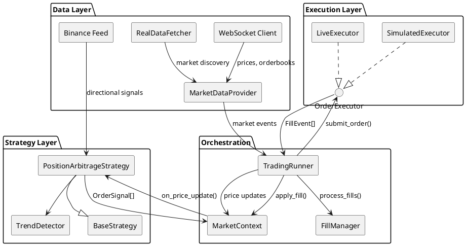
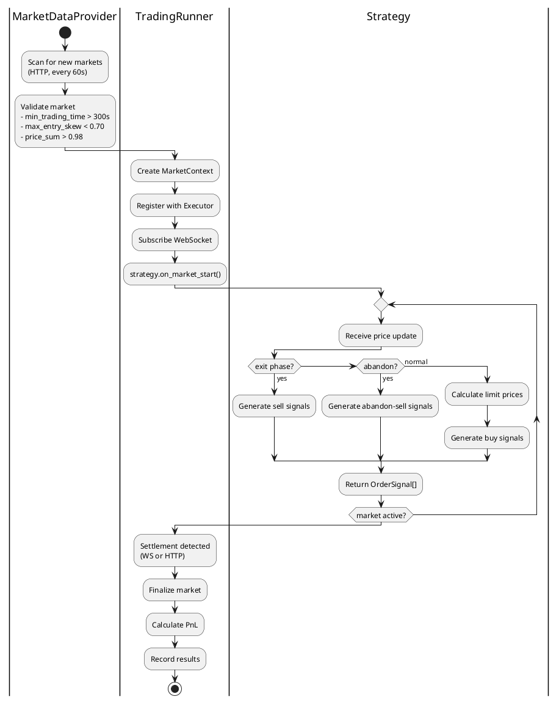
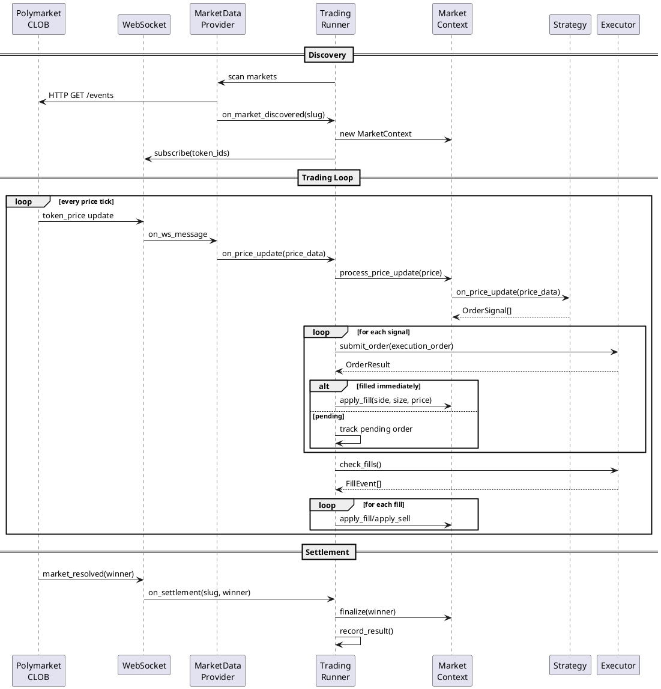
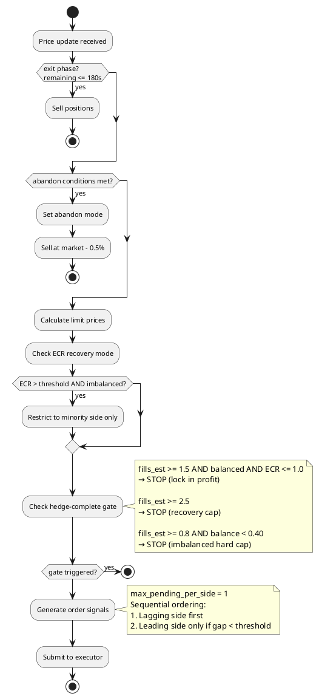
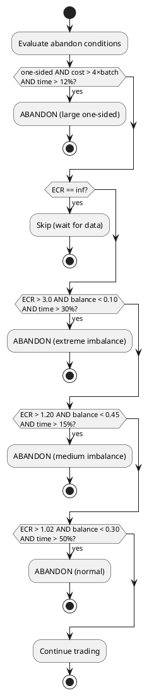
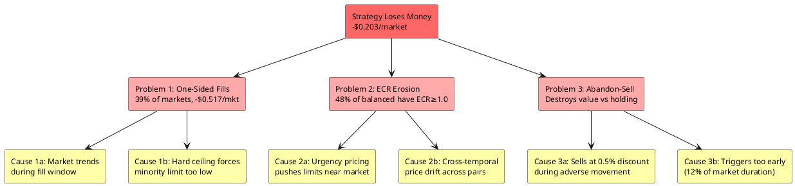
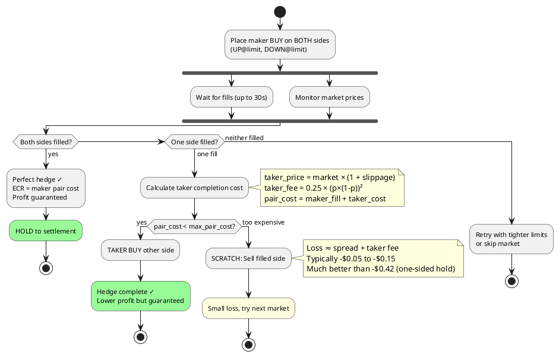
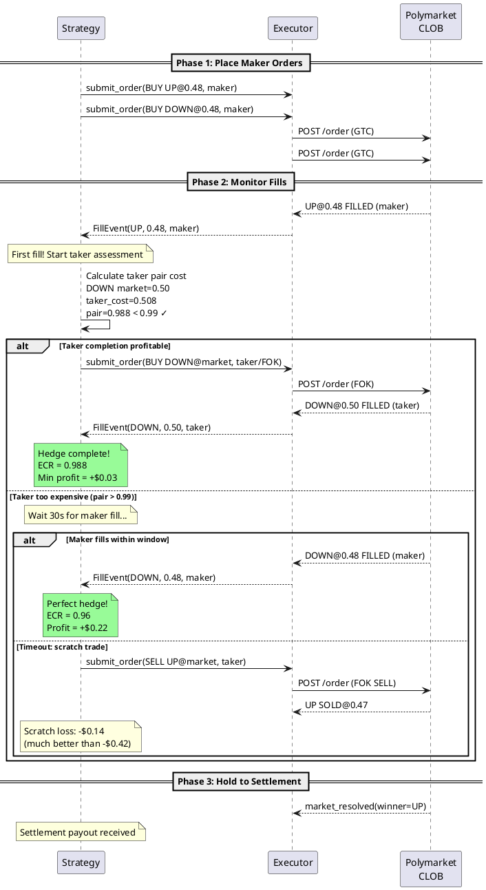
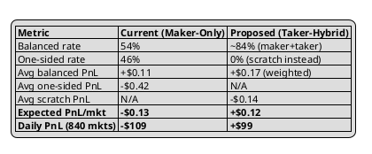
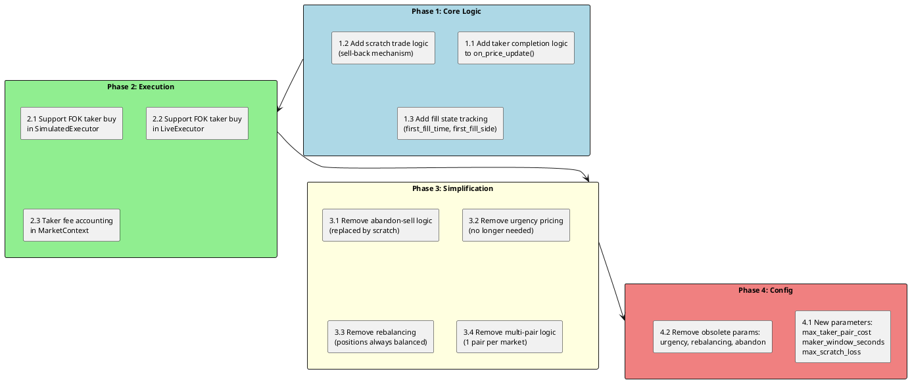

# Position Arbitrage Strategy: First Principles Analysis

> Last updated: 2026-03-02
> Status: Living document — single source of truth for strategy design

---

## Table of Contents

1. [Mathematical Foundations](#1-mathematical-foundations)
2. [System Architecture](#2-system-architecture)
3. [Current Strategy: How It Works](#3-current-strategy-how-it-works)
4. [Performance Analysis: Why We Lose Money](#4-performance-analysis-why-we-lose-money)
5. [Root Cause Analysis](#5-root-cause-analysis)
6. [Proposed Solution: Taker-Hybrid Architecture](#6-proposed-solution-taker-hybrid-architecture)
7. [Implementation Plan](#7-implementation-plan)
8. [Appendix: Parameter Reference](#8-appendix-parameter-reference)

---

## 1. Mathematical Foundations

### 1.1 Binary Market Arbitrage Theorem

In Polymarket's binary UP/DOWN markets:

- **Two tokens**: UP and DOWN
- **Settlement**: Winner pays $1/share, loser pays $0/share
- **Exactly one side wins** — it's a complete probability space

**Theorem**: If you hold `n` shares of UP and `n` shares of DOWN, your settlement payout is **exactly `n × $1`**, regardless of outcome.

```
Proof:
  If UP wins:  payout = n × $1 (UP) + n × $0 (DOWN) = $n
  If DOWN wins: payout = n × $0 (UP) + n × $1 (DOWN) = $n
  ∴ Payout = $n in all cases  □
```

**The Arbitrage Condition**: If total cost to acquire `n` UP + `n` DOWN < `$n`, profit is guaranteed.

Define **ECR** (Effective Cost Rate):

```
ECR = total_cost / min(up_shares, down_shares)

If ECR < 1.0 → guaranteed profit = min(up, down) × (1 - ECR)
If ECR = 1.0 → break-even
If ECR > 1.0 → guaranteed loss (on hedged portion)
```

### 1.2 The Profit Source: Bid-Ask Spread

Market makers earn the bid-ask spread by providing liquidity:

```
Market mid-prices:  UP = $0.50, DOWN = $0.50  (sum = $1.00)
Maker buy limits:   UP = $0.48, DOWN = $0.48  (sum = $0.96)
```

The $0.04 discount per pair ($0.96 vs $1.00) is the maker's reward for waiting.

**Fee structure** (Polymarket crypto markets):
- Makers: **0% fee** (plus daily 20% rebate from taker fees)
- Takers: **~1.56% max** at 50¢, formula: `0.25 × (p × (1-p))²`

```
Taker fee examples:
  p = 0.50 → 1.5625%
  p = 0.45 → 1.53%
  p = 0.40 → 1.44%
  p = 0.30 → 1.10%
```

### 1.3 The Fill Risk Problem

The arbitrage requires BOTH sides to fill. Single-side fills create directional exposure:

```
Scenario: Buy UP@$0.48 (fills), Buy DOWN@$0.48 (doesn't fill)

  State: Holding 5.4 UP shares, cost = $2.59
  If UP wins:  payout = $5.40, PnL = +$2.81
  If DOWN wins: payout = $0.00, PnL = -$2.59
  
  Expected PnL = P(UP) × $2.81 + P(DOWN) × (-$2.59)
```

**Critical insight**: When one side fails to fill, the market has typically **trended away** from that side. If DOWN didn't fill, UP probably went up → P(DOWN wins) increased → our UP position is likely the losing side.

### 1.4 Break-Even Analysis

Let:
- `p` = probability of balanced fill (both sides)
- `W` = profit per balanced market
- `L` = loss per one-sided market

```
Break-even: p × W = (1-p) × |L|
  → p = |L| / (W + |L|)

With current data (W = $0.11, L = $0.42):
  → p = 0.42 / (0.11 + 0.42) = 79.2%

We need 79% balanced fill rate to break even.
Currently at 54%. This is the fundamental problem.
```

---

## 2. System Architecture

### 2.1 Component Diagram



### 2.2 Market Lifecycle



### 2.3 Data Flow



---

## 3. Current Strategy: How It Works

### 3.1 Order Pricing (Pseudocode)

```python
def calculate_limit_prices(up_price, down_price) -> (up_limit, down_limit):
    price_sum = up_price + down_price
    effective_target = get_adaptive_target()  # 0.94 to 0.955
    
    if price_sum <= effective_target:
        return (up_price, down_price)  # already below target
    
    # Step 1: Base allocation (proportional scaling)
    if max(up_price, down_price) > trend_patience_threshold:  # 0.57
        # Asymmetric: trending side gets small discount, other absorbs rest
        dominant_limit = dominant_price * (1 - 0.005)  # 0.5% below market
        minority_limit = effective_target - dominant_limit
    else:
        # Symmetric: same % discount on both sides
        scale = effective_target / price_sum
        up_limit = up_price * scale
        down_limit = down_price * scale
    
    # Step 2: Urgency adjustment (move limits closer to market as time passes)
    urgency = calculate_urgency(time_elapsed, imbalance)
    offset_reduction = urgency * urgency_price_factor  # max 0.25
    up_limit += (up_price - up_limit) * offset_reduction
    down_limit += (down_price - down_limit) * offset_reduction
    
    # Step 3: Floor (minimum viable price)
    up_limit = max(up_limit, 0.05)
    down_limit = max(down_limit, 0.05)
    
    # Step 4: HARD CEILING (pair cost must not exceed target)
    if up_limit + down_limit > effective_target:
        scale = effective_target / (up_limit + down_limit)
        up_limit *= scale
        down_limit *= scale
    
    # Step 5: ECR counterpart cap (when imbalanced)
    if balance_ratio < 0.85:
        # Cap limit so pair with historical avg doesn't exceed 1.10
        ...
    
    # Step 6: Minimum maker discount (stay 1.5%+ below market)
    up_limit = min(up_limit, up_price * (1 - min_maker_discount))
    down_limit = min(down_limit, down_price * (1 - min_maker_discount))
    
    # Step 7: FINAL HARD CEILING (re-enforce after all adjustments)
    if up_limit + down_limit > effective_target:
        scale = effective_target / (up_limit + down_limit)
        up_limit *= scale
        down_limit *= scale
    
    return (up_limit, down_limit)
```

### 3.2 Position Building Flow



### 3.3 Abandon Decision Tree



---

## 4. Performance Analysis: Why We Lose Money

### 4.1 Production Data (1698 Markets)

| Category | Count | % | Total PnL | Avg PnL/mkt |
|----------|-------|---|-----------|-------------|
| **Balanced** (both sides filled, bal > 0.85) | 1038 | 61% | -$3.80 | **-$0.004** |
| **Non-balanced** (one-sided or imbalanced) | 660 | 39% | -$341.54 | **-$0.517** |
| **Total** | 1698 | 100% | **-$345.34** | **-$0.203** |

### 4.2 Non-Balanced Breakdown by Fill Count

| Fills | Count | Avg PnL | Description |
|-------|-------|---------|-------------|
| 0 | 281 | $0.000 | Never entered (no fills at all) |
| 1 | 70 | -$0.772 | One side only |
| 2 | 51 | -$0.803 | Two fills but imbalanced |
| 3 | 69 | -$1.019 | Three fills, asymmetric |
| 4 | 148 | -$0.872 | Four fills but imbalanced |
| 5+ | 41 | -$0.949 | Many fills, still imbalanced |

### 4.3 Abandon-Sell vs Hold

| Exit Method | Count | Avg PnL |
|-------------|-------|---------|
| Abandon-sell (sell before settlement) | 351 | **-$0.885** |
| Hold to settlement (no sell) | 309 | **-$0.100** |

**Key finding**: Abandon-sell loses 8.85× more per market than holding. The sell mechanism destroys value because it sells at a discount during an unfavorable price movement.

### 4.4 ECR Distribution (Balanced Markets Only)

```
ECR < 1.0 (profitable):  535/1038 = 52%
ECR >= 1.0 (losing):     503/1038 = 48%

Median ECR: 0.9957
```

**48% of "balanced" markets have ECR ≥ 1.0** — they're losing money even with both sides filled. The target cost (0.96) is being eroded by urgency pricing, fill asymmetry, and cross-temporal drift.

### 4.5 Per-Coin Performance

| Coin | Markets | Balanced Rate | Total PnL | Avg PnL |
|------|---------|--------------|-----------|---------|
| BTC | 569 | 63% | -$116.80 | -$0.205 |
| ETH | 569 | 61% | -$120.40 | -$0.212 |
| SOL | 560 | 60% | -$108.13 | -$0.193 |

All three coins lose money at similar rates. The problem is structural, not coin-specific.

### 4.6 Recent Post-Hotfix Performance (48 Markets)

After parameter tightening (fills limited to 1-2 per market):

| Category | Count | Avg PnL |
|----------|-------|---------|
| Balanced (fills=2) | 26 (54%) | **+$0.112** |
| One-sided with abandon-sell | 21 (44%) | **-$0.418** |

Balanced markets are consistently profitable when ECR is controlled. But one-sided losses wipe out the gains.

---

## 5. Root Cause Analysis

### 5.1 Problem Taxonomy



### 5.2 The Fundamental Issue: Maker-Only Doesn't Work

The current strategy uses **maker-only orders** (limit orders below market). This creates an inherent vulnerability:

```
Time T=0:   UP=0.50, DOWN=0.50
            Place: BUY UP@0.48, BUY DOWN@0.48

Time T=10s: Market trends → UP=0.55, DOWN=0.45
            DOWN@0.48 fills (above market, sellers hit our bid)
            UP@0.48 is 12.7% below market → won't fill

Time T=60s: Market continues → UP=0.60, DOWN=0.40
            Hard ceiling: UP_limit = 0.955 - 0.40×0.97 = 0.567
            But UP@0.567 is 5.5% below market → still hard to fill

Time T=108s: Abandon fires → sell DOWN at 0.40×0.995 = $0.398
             Cost was $2.59, recover $2.15, loss = -$0.44
```

**The paradox**: The side that fills easily is the one trending AGAINST us. The side we need (to complete the hedge) is trending AWAY, making it increasingly expensive.

### 5.3 Why Maker-Only Has a Hard Ceiling on Fill Rate

In a 50/50 market with 4% total discount:
- Each limit is ~2% below market
- In a trending market, one side quickly moves beyond 2%
- With min_maker_discount=1.5%, the limit is at most 1.5% below market
- A 2% market move (common in 10s for crypto) puts the limit out of reach

The **theoretical maximum balanced fill rate** for pure maker orders depends on market volatility:
- Low volatility: ~80% balanced (most fills complete before market moves)
- Medium volatility: ~55% balanced (current reality)
- High volatility: ~30% balanced (rapid trends invalidate limits)

**Conclusion**: With crypto volatility, maker-only strategy cannot reach the 79% balanced rate needed for profitability.

---

## 6. Proposed Solution: Taker-Hybrid Architecture

### 6.1 Core Concept

**Never hold a one-sided position.** When one side fills as maker, immediately complete the hedge using a taker order if profitable, or scratch the position if not.



### 6.2 Economics Model

**Notation**:
- `n` = shares per side (e.g., 5.4)
- `p_m` = maker fill price (e.g., 0.48)
- `p_t` = taker fill price (e.g., market price)
- `f_t` = taker fee rate (~1.56% at 50¢)
- `s` = bid-ask spread (~1-2%)

#### Case A: Both Maker Fill (Best Case)

```
Probability: ~54% (current data)
Cost:    n × (p_m_up + p_m_down) = 5.4 × 0.96 = $5.18
Payout:  n × $1 = $5.40
PnL:     +$0.22
```

#### Case B: Maker + Taker Completion

```
Probability: ~30% (estimated — currently these become one-sided)
Maker fill: n shares at $p_m, cost = 5.4 × $0.48 = $2.59
Taker fill: n shares at $p_t, cost = 5.4 × $0.50 = $2.70
  (taker receives 5.4 × (1 - 0.0156) = 5.316 shares)

Total cost:  $5.29
If side A wins: payout = n × $1 = $5.40, PnL = +$0.11
If side B wins: payout = 5.316 × $1 = $5.32, PnL = +$0.03
Expected PnL: ~+$0.07
```

#### Case C: Scratch Trade

```
Probability: ~16% (market moved too far for profitable taker completion)
Maker fill: bought 5.4 shares at $0.48, cost = $2.59
Scratch sell: 5.4 shares at market (e.g., $0.46), taker fee ~1.5%
  Proceeds = 5.4 × $0.46 × (1 - 0.015) = $2.45
Loss: $2.59 - $2.45 = -$0.14
```

#### Expected Value

```
EV = 0.54 × $0.22 + 0.30 × $0.07 + 0.16 × (-$0.14)
   = $0.119 + $0.021 - $0.022
   = +$0.118 per market

Daily (840 markets): +$99/day
Monthly: +$2,970/month
```

vs current: **-$0.203/market = -$170/day = -$5,100/month**

### 6.3 Decision Logic (Pseudocode)

```python
# Maximum pair cost for taker completion.
# Must be < 1.0 for guaranteed profit. Budget for fees.
MAX_TAKER_PAIR_COST = 0.99  # 1% margin after fees

# Time window to wait for maker fill before attempting taker
MAKER_WINDOW_SECONDS = 30

# Maximum acceptable scratch loss per market (USD)
MAX_SCRATCH_LOSS = 0.20

def on_first_fill(filled_side, fill_price, fill_size):
    """Called when one side fills as maker."""
    
    other_side = opposite(filled_side)
    other_market_price = get_market_price(other_side)
    
    # Calculate taker completion cost
    taker_fee_rate = 0.25 * (other_market_price * (1 - other_market_price)) ** 2
    taker_effective_cost = other_market_price / (1 - taker_fee_rate)
    pair_cost = fill_price + taker_effective_cost
    
    if pair_cost < MAX_TAKER_PAIR_COST:
        # Profitable completion — execute immediately
        submit_taker_buy(other_side, fill_size, other_market_price)
        log(f"TAKER COMPLETE: {other_side} @{other_market_price}, "
            f"pair_cost={pair_cost:.4f}, guaranteed_profit={1-pair_cost:.4f}")
    else:
        # Too expensive — wait for maker fill or scratch
        start_timer(MAKER_WINDOW_SECONDS, on_maker_timeout)


def on_maker_timeout():
    """Called when maker fill window expires without second fill."""

    other_market_price = get_market_price(other_side)
    taker_fee_rate = 0.25 * (other_market_price * (1 - other_market_price)) ** 2
    taker_effective_cost = other_market_price / (1 - taker_fee_rate)
    pair_cost = fill_price + taker_effective_cost
    
    if pair_cost < MAX_TAKER_PAIR_COST:
        # Market returned — taker complete is now profitable
        submit_taker_buy(other_side, fill_size, other_market_price)
    else:
        # Scratch the position
        submit_taker_sell(filled_side, fill_size, get_market_price(filled_side))
        log(f"SCRATCH: sold {filled_side} @market, "
            f"loss={calculate_scratch_loss():.2f}")


def on_second_maker_fill(side, fill_price, fill_size):
    """Both sides filled as maker — perfect hedge."""
    cancel_timer()
    log(f"PERFECT HEDGE: ECR={calculate_ecr():.4f}, "
        f"guaranteed_profit={min(up_shares,down_shares)*(1-ecr):.2f}")
    # Hold to settlement — no further action needed
```

### 6.4 Sequence Diagram



### 6.5 Comparison: Current vs Proposed



### 6.6 Risk Analysis

**What could go wrong?**

| Risk | Impact | Mitigation |
|------|--------|------------|
| Taker fill slippage | Higher completion cost | Use FOK orders with price limit |
| Scratch sell slippage | Higher scratch loss | Set max_scratch_loss cap |
| Both fills fail | No position (zero PnL) | Retry or skip — no directional risk |
| Taker fees increase | Lower margin | Monitor fee rates, adjust thresholds |
| High volatility periods | More scratches | Widen maker discount in volatile markets |
| API latency | Late taker execution | Use WebSocket for instant fill detection |

**Key invariant**: The strategy NEVER holds an unhedged position longer than `MAKER_WINDOW_SECONDS` (30s). If the hedge cannot be completed profitably, the position is immediately scratched.

---

## 7. Implementation Plan

### 7.1 Code Changes Required



### 7.2 Simplified Strategy (Target State)

The taker-hybrid approach dramatically simplifies the strategy:

**Current complexity** (~2800 lines):
- Urgency pricing
- Fill-rate EMA tracking
- Rebalancing (buy + sell)
- Abandon detection (4 conditions)
- Abandon-sell generation
- ECR recovery mode
- Directional recovery
- Multi-pair hedge-complete gate
- Sequential ordering
- Counterpart ECR cap
- Phase-based behavior (3 phases)
- Exit-phase selling

**Target simplicity** (~800 lines):
- Place maker orders on both sides
- Monitor fills
- On first fill: assess taker completion
- Execute taker or scratch
- Hold balanced position to settlement

```python
# Simplified on_price_update (target state)
def on_price_update(self, price_data: PriceData) -> List[OrderSignal]:
    signals = []
    up_price = price_data.up_price
    down_price = price_data.down_price
    
    # State: NO_POSITION → FIRST_FILL → HEDGED
    
    if self._state == "NO_POSITION":
        # Place maker orders on both sides
        up_limit, down_limit = self._calculate_limits(up_price, down_price)
        signals.extend(self._place_maker_orders(up_limit, down_limit))
        
    elif self._state == "FIRST_FILL":
        elapsed = time.time() - self._first_fill_time
        other_side = opposite(self._first_fill_side)
        other_price = price_data[other_side]
        
        # Can we complete the hedge as taker?
        pair_cost = self._first_fill_price + other_price * (1 + self._taker_fee(other_price))
        
        if pair_cost < self.max_taker_pair_cost:
            # Yes — execute taker completion
            signals.append(self._taker_buy(other_side, other_price))
            self._state = "HEDGED"
            
        elif elapsed > self.maker_window_seconds:
            # Timeout — scratch the position
            signals.append(self._scratch_sell(self._first_fill_side))
            self._state = "SCRATCHED"
            
        else:
            # Still waiting for maker fill on other side
            signals.extend(self._refresh_maker_order(other_side, other_price))
    
    elif self._state == "HEDGED":
        pass  # Hold to settlement
    
    return signals
```

### 7.3 Migration Strategy

1. **Keep the current strategy as-is** (rename to `PositionArbitrageV1`)
2. **Build the new strategy in a new file** (`position_arbitrage_v2.py`)
3. **Run both in parallel** (V1 on paper, V2 on paper)
4. **Compare results** over 24-48 hours
5. **Switch to V2** once validated

---

## 8. Appendix: Parameter Reference

### 8.1 Current Parameters (strategy_defaults.yaml)

| Section | Parameter | Value | Purpose |
|---------|-----------|-------|---------|
| strategy | target_cost | 0.96 | Base pair cost target |
| strategy | adaptive_target_max | 0.955 | Max adaptive target |
| strategy | adaptive_target_min | 0.94 | Min adaptive target |
| strategy | min_maker_discount | 0.03 | Min distance below market |
| strategy | batch_ratio | 0.001 | Order size fraction |
| strategy | min_order_shares | 5 | Polymarket minimum |
| strategy | position_size | 100.0 | Max per-market |
| strategy | order_timeout | 60 | Cancel unfilled orders |
| risk | ecr_threshold | 1.05 | ECR stop-loss |
| risk | max_skew_threshold | 0.85 | Skip skewed markets |
| risk | trend_patience_threshold | 0.57 | Asymmetric pricing trigger |
| stop_loss | abandon_ecr_threshold | 1.02 | Abandon trigger |
| simulation | max_entry_skew | 0.70 | Entry filter |
| simulation | min_trading_time | 300 | Min time to enter |
| fund | max_concurrent_markets | 6 | Concurrent limit |
| fund | max_total_exposure | 500 | Total exposure cap |

### 8.2 Proposed New Parameters (V2)

| Parameter | Proposed Value | Purpose |
|-----------|---------------|---------|
| max_taker_pair_cost | 0.99 | Max pair cost for taker completion |
| maker_window_seconds | 30 | Wait for maker before scratch |
| max_scratch_loss_pct | 0.05 | Max acceptable scratch loss |
| taker_slippage_buffer | 0.005 | Price buffer for taker orders |
| enable_taker_completion | true | Master switch for taker logic |
| min_maker_discount | 0.015 | Tighter for V2 (was 0.03) |

### 8.3 Polymarket Fee Reference

| Fee Type | Rate | Applied To |
|----------|------|-----------|
| Maker buy | 0% | Limit order that provides liquidity |
| Taker buy | ~1.56% max | Aggressive order that takes liquidity |
| Maker sell | 0% | Limit sell that provides liquidity |
| Taker sell | ~1.56% max | Market sell that takes liquidity |
| Maker rebate | ~20% of taker fees | Daily distribution |

Fee formula: `fee_rate = 0.25 × (price × (1 - price))²`

---

## Document History

| Date | Change |
|------|--------|
| 2026-03-02 | Initial creation. First-principles analysis based on 1698 markets of production data. |
