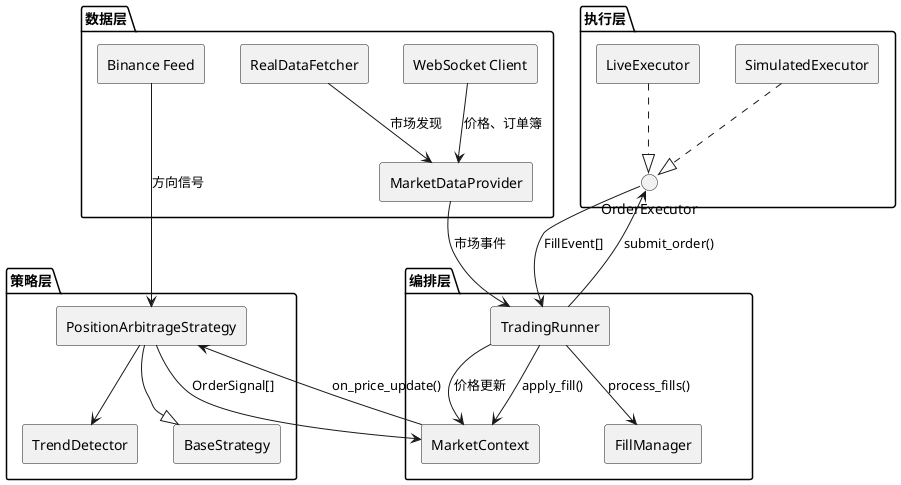
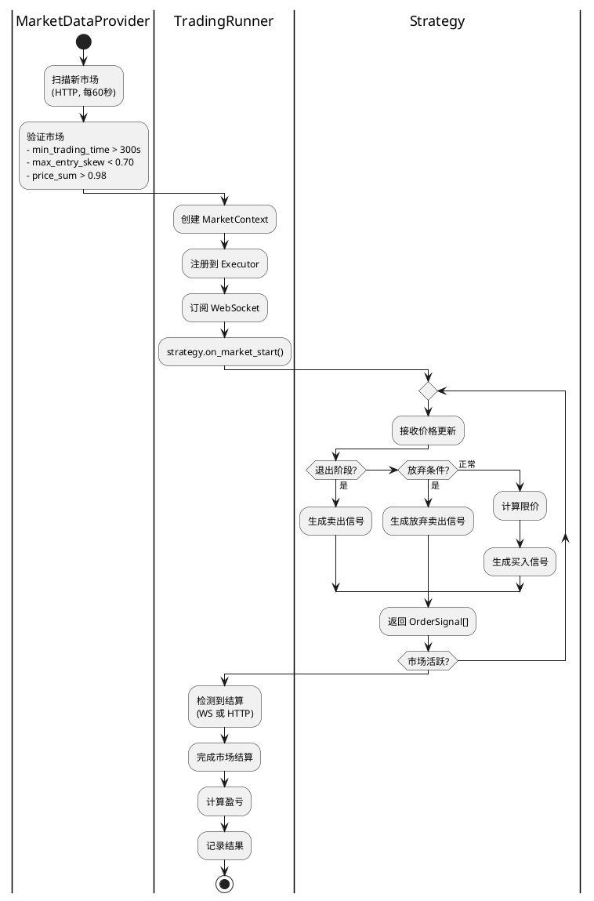
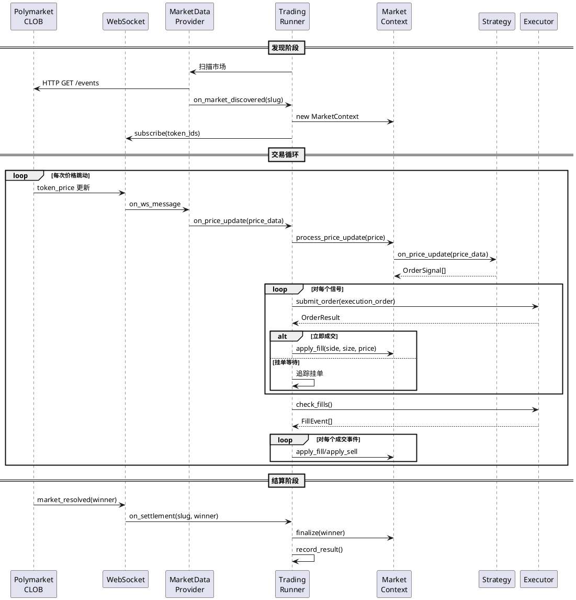
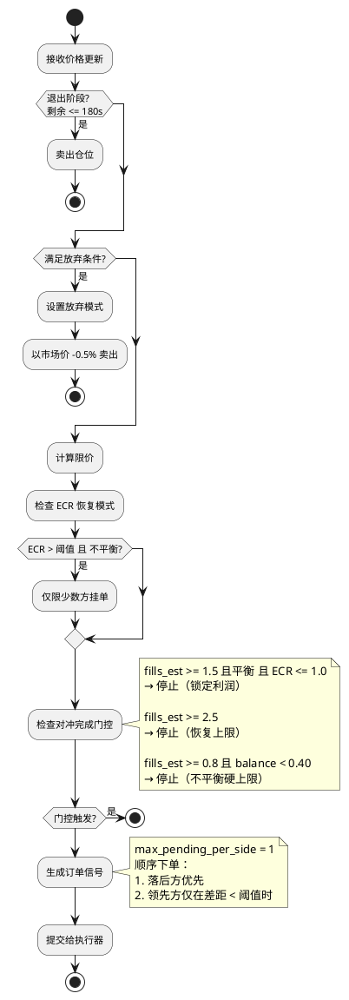
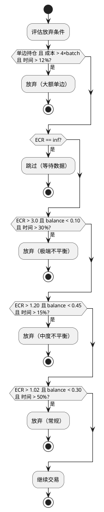
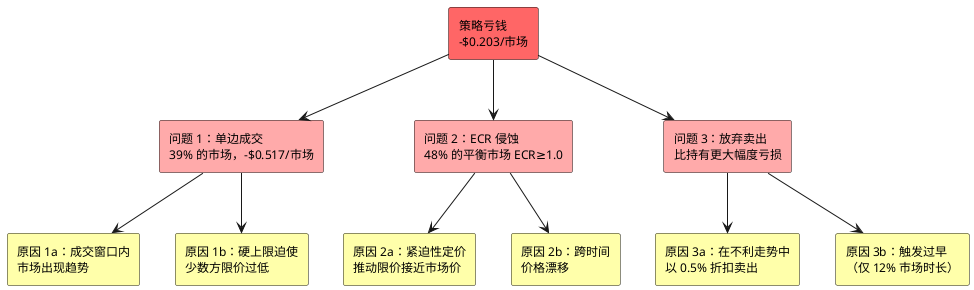
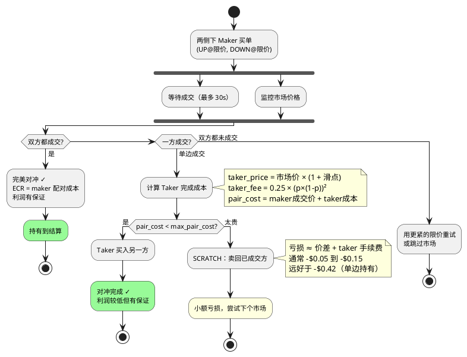
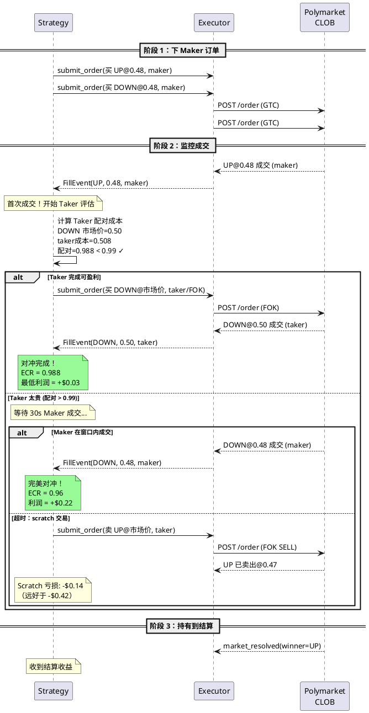
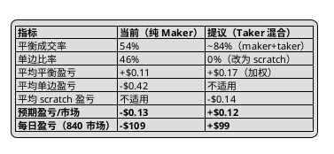
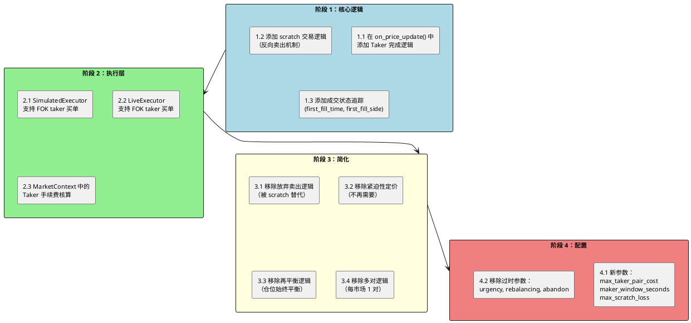

# 仓位套利策略：第一性原理分析

> 最后更新：2026-03-02
> 状态：动态文档 — 策略设计的唯一真实来源

---

## 目录

1. [数学基础](#1-数学基础)
2. [系统架构](#2-系统架构)
3. [当前策略：运作方式](#3-当前策略运作方式)
4. [绩效分析：为什么亏钱](#4-绩效分析为什么亏钱)
5. [根因分析](#5-根因分析)
6. [解决方案：Taker 混合架构](#6-解决方案taker-混合架构)
7. [实施计划](#7-实施计划)
8. [附录：参数参考](#8-附录参数参考)

---

## 1. 数学基础

### 1.1 二元市场套利定理

在 Polymarket 的二元 UP/DOWN 市场中：

- **两种代币**：UP 和 DOWN
- **结算规则**：赢家支付 $1/份，输家支付 $0/份
- **恰好一方获胜** — 构成完备概率空间

**定理**：若持有 `n` 份 UP 和 `n` 份 DOWN，结算收益**恒为 `n × $1`**，与结果无关。

```
证明：
  若 UP 赢：收益 = n × $1 (UP) + n × $0 (DOWN) = $n
  若 DOWN 赢：收益 = n × $0 (UP) + n × $1 (DOWN) = $n
  ∴ 收益 = $n（所有情况）  □
```

**套利条件**：若买入 `n` UP + `n` DOWN 的总成本 < `$n`，则利润有保证。

定义 **ECR**（有效成本率）：

```
ECR = 总成本 / min(up份额, down份额)

若 ECR < 1.0 → 保底利润 = min(up, down) × (1 - ECR)
若 ECR = 1.0 → 持平
若 ECR > 1.0 → 保底亏损（对冲部分）
```

### 1.2 利润来源：买卖价差

做市商通过提供流动性赚取买卖价差：

```
市场中间价：  UP = $0.50, DOWN = $0.50  (总和 = $1.00)
Maker 限价：  UP = $0.48, DOWN = $0.48  (总和 = $0.96)
```

每对 $0.04 的折扣（$0.96 vs $1.00）是做市商等待的回报。

**手续费结构**（Polymarket 加密市场）：
- Maker（挂单方）：**0% 手续费**（加上每日 20% 的 taker 费用返佣）
- Taker（吃单方）：**最高约 1.56%**（50¢ 时），公式：`0.25 × (p × (1-p))²`

```
Taker 手续费示例：
  p = 0.50 → 1.5625%
  p = 0.45 → 1.53%
  p = 0.40 → 1.44%
  p = 0.30 → 1.10%
```

### 1.3 成交风险问题

套利要求双方**都成交**。单边成交会产生方向性敞口：

```
场景：买入 UP@$0.48（成交），买入 DOWN@$0.48（未成交）

  状态：持有 5.4 份 UP，成本 = $2.59
  若 UP 赢：收益 = $5.40，盈亏 = +$2.81
  若 DOWN 赢：收益 = $0.00，盈亏 = -$2.59
  
  预期盈亏 = P(UP赢) × $2.81 + P(DOWN赢) × (-$2.59)
```

**关键洞察**：当一边未能成交时，市场通常已经**趋势偏离**了该方向。如果 DOWN 未成交，说明 UP 可能涨了 → P(DOWN 赢) 增加 → 我们的 UP 仓位很可能是亏损的一方。

### 1.4 盈亏平衡分析

设：
- `p` = 平衡成交概率（双边都成交）
- `W` = 每个平衡市场的利润
- `L` = 每个单边市场的亏损

```
盈亏平衡：p × W = (1-p) × |L|
  → p = |L| / (W + |L|)

根据当前数据（W = $0.11，L = $0.42）：
  → p = 0.42 / (0.11 + 0.42) = 79.2%

我们需要 79% 的平衡成交率才能盈亏平衡。
当前仅 54%。这是根本性问题。
```

---

## 2. 系统架构

### 2.1 组件图



### 2.2 市场生命周期



### 2.3 数据流



---

## 3. 当前策略：运作方式

### 3.1 订单定价（伪代码）

```python
def calculate_limit_prices(up_price, down_price) -> (up_limit, down_limit):
    price_sum = up_price + down_price
    effective_target = get_adaptive_target()  # 0.94 ~ 0.955
    
    if price_sum <= effective_target:
        return (up_price, down_price)  # 已低于目标
    
    # 步骤 1：基础分配（按比例缩放）
    if max(up_price, down_price) > trend_patience_threshold:  # 0.57
        # 非对称：趋势方向小折扣，另一方吸收剩余
        dominant_limit = dominant_price * (1 - 0.005)  # 低于市场 0.5%
        minority_limit = effective_target - dominant_limit
    else:
        # 对称：两侧相同百分比折扣
        scale = effective_target / price_sum
        up_limit = up_price * scale
        down_limit = down_price * scale
    
    # 步骤 2：紧迫性调整（随时间推移限价靠近市场价）
    urgency = calculate_urgency(time_elapsed, imbalance)
    offset_reduction = urgency * urgency_price_factor  # 最大 0.25
    up_limit += (up_price - up_limit) * offset_reduction
    down_limit += (down_price - down_limit) * offset_reduction
    
    # 步骤 3：价格下限（最低可行价格）
    up_limit = max(up_limit, 0.05)
    down_limit = max(down_limit, 0.05)
    
    # 步骤 4：硬上限（配对成本不得超过目标）
    if up_limit + down_limit > effective_target:
        scale = effective_target / (up_limit + down_limit)
        up_limit *= scale
        down_limit *= scale
    
    # 步骤 5：ECR 对手限制（不平衡时）
    if balance_ratio < 0.85:
        # 限制限价，使配对与历史均价不超过 1.10
        ...
    
    # 步骤 6：最小 Maker 折扣（保持低于市场 1.5%+）
    up_limit = min(up_limit, up_price * (1 - min_maker_discount))
    down_limit = min(down_limit, down_price * (1 - min_maker_discount))
    
    # 步骤 7：最终硬上限（所有调整后重新强制执行）
    if up_limit + down_limit > effective_target:
        scale = effective_target / (up_limit + down_limit)
        up_limit *= scale
        down_limit *= scale
    
    return (up_limit, down_limit)
```

### 3.2 仓位构建流程



### 3.3 放弃决策树



---

## 4. 绩效分析：为什么亏钱

### 4.1 生产数据（1698 个市场）

| 类别 | 数量 | 占比 | 总盈亏 | 平均盈亏/市场 |
|------|------|------|--------|--------------|
| **平衡**（双边成交，bal > 0.85） | 1038 | 61% | -$3.80 | **-$0.004** |
| **非平衡**（单边或不平衡） | 660 | 39% | -$341.54 | **-$0.517** |
| **总计** | 1698 | 100% | **-$345.34** | **-$0.203** |

### 4.2 非平衡市场按成交次数分类

| 成交次数 | 数量 | 平均盈亏 | 说明 |
|----------|------|---------|------|
| 0 | 281 | $0.000 | 从未入场（无成交） |
| 1 | 70 | -$0.772 | 仅一方成交 |
| 2 | 51 | -$0.803 | 两次成交但不平衡 |
| 3 | 69 | -$1.019 | 三次成交，不对称 |
| 4 | 148 | -$0.872 | 四次成交但仍不平衡 |
| 5+ | 41 | -$0.949 | 多次成交，仍然不平衡 |

### 4.3 放弃卖出 vs 持有到结算

| 退出方式 | 数量 | 平均盈亏 |
|----------|------|---------|
| 放弃卖出（结算前卖出） | 351 | **-$0.885** |
| 持有到结算（不卖出） | 309 | **-$0.100** |

**关键发现**：放弃卖出的每市场亏损是持有的 8.85 倍。卖出机制在不利价格变动期间以折扣价卖出，反而摧毁价值。

### 4.4 ECR 分布（仅平衡市场）

```
ECR < 1.0（盈利）：535/1038 = 52%
ECR >= 1.0（亏损）：503/1038 = 48%

中位数 ECR：0.9957
```

**48% 的"平衡"市场 ECR ≥ 1.0** — 即使双边都成交也在亏钱。目标成本（0.96）被紧迫性定价、成交不对称和跨时间价格漂移所侵蚀。

### 4.5 按币种表现

| 币种 | 市场数 | 平衡率 | 总盈亏 | 平均盈亏 |
|------|--------|--------|--------|---------|
| BTC | 569 | 63% | -$116.80 | -$0.205 |
| ETH | 569 | 61% | -$120.40 | -$0.212 |
| SOL | 560 | 60% | -$108.13 | -$0.193 |

三个币种的亏损率相近。问题是结构性的，而非币种特有的。

### 4.6 近期热修复后表现（48 个市场）

参数收紧后（每市场限制 1-2 次成交）：

| 类别 | 数量 | 平均盈亏 |
|------|------|---------|
| 平衡（成交=2） | 26 (54%) | **+$0.112** |
| 单边且放弃卖出 | 21 (44%) | **-$0.418** |

当 ECR 得到控制时，平衡市场稳定盈利。但单边亏损抹平了收益。

---

## 5. 根因分析

### 5.1 问题分类



### 5.2 根本问题：纯 Maker 模式不可行

当前策略使用**纯 Maker 订单**（低于市场的限价单）。这造成了固有的脆弱性：

```
T=0:    UP=0.50, DOWN=0.50
        下单：买 UP@0.48, 买 DOWN@0.48

T=10s:  市场趋势 → UP=0.55, DOWN=0.45
        DOWN@0.48 成交（高于市场价，卖方吃掉我们的买单）
        UP@0.48 低于市场 12.7% → 不会成交

T=60s:  市场继续 → UP=0.60, DOWN=0.40
        硬上限：UP_limit = 0.955 - 0.40×0.97 = 0.567
        但 UP@0.567 仍低于市场 5.5% → 仍然难以成交

T=108s: 放弃触发 → 以 0.40×0.995 = $0.398 卖出 DOWN
        成本 $2.59，收回 $2.15，亏损 = -$0.44
```

**悖论**：容易成交的一方恰恰是趋势**对我们不利**的方向。我们需要的一方（完成对冲）正在趋势**远离**，使其越来越贵。

### 5.3 纯 Maker 模式的成交率天花板

在 50/50 市场中，总折扣 4%：
- 每方限价大约低于市场 2%
- 在趋势市场中，一方很快超出 2%
- min_maker_discount=1.5% 时，限价最多低于市场 1.5%
- 加密货币 10 秒内 2% 的波动很常见，这会让限价失效

纯 Maker 订单的**理论最大平衡成交率**取决于市场波动率：
- 低波动率：约 80% 平衡（大多数成交在市场波动前完成）
- 中波动率：约 55% 平衡（当前现实）
- 高波动率：约 30% 平衡（快速趋势使限价失效）

**结论**：在加密货币波动率下，纯 Maker 策略无法达到盈利所需的 79% 平衡成交率。

---

## 6. 解决方案：Taker 混合架构

### 6.1 核心理念

**永远不持有单边仓位。** 当一方以 Maker 成交后，如果有利可图则立即用 Taker 订单完成对冲，否则 scratch（反向卖出）退出仓位。



### 6.2 经济学模型

**符号说明**：
- `n` = 每方份额（如 5.4）
- `p_m` = Maker 成交价（如 0.48）
- `p_t` = Taker 成交价（如市场价）
- `f_t` = Taker 手续费率（50¢ 时约 1.56%）
- `s` = 买卖价差（约 1-2%）

#### 情况 A：双方 Maker 成交（最佳情况）

```
概率：约 54%（当前数据）
成本：  n × (p_m_up + p_m_down) = 5.4 × 0.96 = $5.18
收益：  n × $1 = $5.40
盈亏：  +$0.22
```

#### 情况 B：Maker + Taker 完成对冲

```
概率：约 30%（估算 — 目前这些变成了单边仓位）
Maker 成交：n 份 @$p_m，成本 = 5.4 × $0.48 = $2.59
Taker 成交：n 份 @$p_t，成本 = 5.4 × $0.50 = $2.70
  （taker 实际获得 5.4 × (1 - 0.0156) = 5.316 份）

总成本：$5.29
若 A 方赢：收益 = n × $1 = $5.40，盈亏 = +$0.11
若 B 方赢：收益 = 5.316 × $1 = $5.32，盈亏 = +$0.03
预期盈亏：约 +$0.07
```

#### 情况 C：Scratch 交易

```
概率：约 16%（市场偏移过大，Taker 完成不划算）
Maker 成交：买入 5.4 份 @$0.48，成本 = $2.59
Scratch 卖出：5.4 份 @市场价（如 $0.46），taker 手续费约 1.5%
  收回 = 5.4 × $0.46 × (1 - 0.015) = $2.45
亏损：$2.59 - $2.45 = -$0.14
```

#### 预期收益

```
EV = 0.54 × $0.22 + 0.30 × $0.07 + 0.16 × (-$0.14)
   = $0.119 + $0.021 - $0.022
   = +$0.118/市场

每日（840 个市场）：+$99/天
每月：+$2,970/月
```

对比当前：**-$0.203/市场 = -$170/天 = -$5,100/月**

### 6.3 决策逻辑（伪代码）

```python
# Taker 完成的最大配对成本
# 必须 < 1.0 才能保证利润。预留手续费空间。
MAX_TAKER_PAIR_COST = 0.99  # 扣除手续费后 1% 利润率

# 等待 Maker 成交的时间窗口，之后尝试 Taker
MAKER_WINDOW_SECONDS = 30

# 每市场最大可接受的 scratch 亏损（美元）
MAX_SCRATCH_LOSS = 0.20

def on_first_fill(filled_side, fill_price, fill_size):
    """当一方以 Maker 成交时调用。"""
    
    other_side = opposite(filled_side)
    other_market_price = get_market_price(other_side)
    
    # 计算 Taker 完成成本
    taker_fee_rate = 0.25 * (other_market_price * (1 - other_market_price)) ** 2
    taker_effective_cost = other_market_price / (1 - taker_fee_rate)
    pair_cost = fill_price + taker_effective_cost
    
    if pair_cost < MAX_TAKER_PAIR_COST:
        # 可盈利完成 — 立即执行
        submit_taker_buy(other_side, fill_size, other_market_price)
        log(f"TAKER 完成: {other_side} @{other_market_price}, "
            f"pair_cost={pair_cost:.4f}, 保底利润={1-pair_cost:.4f}")
    else:
        # 太贵 — 等待 Maker 成交或 scratch
        start_timer(MAKER_WINDOW_SECONDS, on_maker_timeout)


def on_maker_timeout():
    """Maker 成交窗口过期，未获得第二次成交时调用。"""

    other_market_price = get_market_price(other_side)
    taker_fee_rate = 0.25 * (other_market_price * (1 - other_market_price)) ** 2
    taker_effective_cost = other_market_price / (1 - taker_fee_rate)
    pair_cost = fill_price + taker_effective_cost
    
    if pair_cost < MAX_TAKER_PAIR_COST:
        # 市场回归 — Taker 完成现在可盈利
        submit_taker_buy(other_side, fill_size, other_market_price)
    else:
        # Scratch 仓位
        submit_taker_sell(filled_side, fill_size, get_market_price(filled_side))
        log(f"SCRATCH: 卖出 {filled_side} @市场价, "
            f"亏损={calculate_scratch_loss():.2f}")


def on_second_maker_fill(side, fill_price, fill_size):
    """双方都以 Maker 成交 — 完美对冲。"""
    cancel_timer()
    log(f"完美对冲: ECR={calculate_ecr():.4f}, "
        f"保底利润={min(up_shares,down_shares)*(1-ecr):.2f}")
    # 持有到结算 — 无需进一步操作
```

### 6.4 时序图



### 6.5 对比：当前方案 vs 提议方案



### 6.6 风险分析

**可能出什么问题？**

| 风险 | 影响 | 缓解措施 |
|------|------|----------|
| Taker 成交滑点 | 完成成本更高 | 使用带价格限制的 FOK 订单 |
| Scratch 卖出滑点 | Scratch 亏损更大 | 设置 max_scratch_loss 上限 |
| 双方都未成交 | 无仓位（零盈亏） | 重试或跳过 — 无方向性风险 |
| Taker 手续费上调 | 利润率降低 | 监控费率，调整阈值 |
| 高波动率时期 | 更多 scratch | 在波动市场放大 Maker 折扣 |
| API 延迟 | Taker 执行延迟 | 使用 WebSocket 即时检测成交 |

**核心不变式**：策略**永远不**持有未对冲仓位超过 `MAKER_WINDOW_SECONDS`（30 秒）。如果无法盈利完成对冲，立即 scratch 退出。

---

## 7. 实施计划

### 7.1 需要的代码变更



### 7.2 简化后的策略（目标状态）

Taker 混合方案大幅简化了策略：

**当前复杂度**（约 2800 行）：
- 紧迫性定价
- 成交率 EMA 追踪
- 再平衡（买+卖）
- 放弃检测（4 个条件）
- 放弃卖出生成
- ECR 恢复模式
- 方向恢复
- 多对对冲完成门控
- 顺序下单
- 对手 ECR 上限
- 阶段性行为（3 个阶段）
- 退出阶段卖出

**目标简洁度**（约 800 行）：
- 两侧下 Maker 单
- 监控成交
- 首次成交后：评估 Taker 完成
- 执行 Taker 或 scratch
- 持有平衡仓位到结算

```python
# 简化后的 on_price_update（目标状态）
def on_price_update(self, price_data: PriceData) -> List[OrderSignal]:
    signals = []
    up_price = price_data.up_price
    down_price = price_data.down_price
    
    # 状态：NO_POSITION → FIRST_FILL → HEDGED
    
    if self._state == "NO_POSITION":
        # 两侧下 Maker 单
        up_limit, down_limit = self._calculate_limits(up_price, down_price)
        signals.extend(self._place_maker_orders(up_limit, down_limit))
        
    elif self._state == "FIRST_FILL":
        elapsed = time.time() - self._first_fill_time
        other_side = opposite(self._first_fill_side)
        other_price = price_data[other_side]
        
        # 能否以 Taker 完成对冲？
        pair_cost = self._first_fill_price + other_price * (1 + self._taker_fee(other_price))
        
        if pair_cost < self.max_taker_pair_cost:
            # 可以 — 执行 Taker 完成
            signals.append(self._taker_buy(other_side, other_price))
            self._state = "HEDGED"
            
        elif elapsed > self.maker_window_seconds:
            # 超时 — scratch 退出
            signals.append(self._scratch_sell(self._first_fill_side))
            self._state = "SCRATCHED"
            
        else:
            # 继续等另一方 Maker 成交
            signals.extend(self._refresh_maker_order(other_side, other_price))
    
    elif self._state == "HEDGED":
        pass  # 持有到结算
    
    return signals
```

### 7.3 迁移策略

1. **保留当前策略不变**（重命名为 `PositionArbitrageV1`）
2. **在新文件中构建新策略**（`position_arbitrage_v2.py`）
3. **并行运行**（V1 模拟盘，V2 模拟盘）
4. **对比结果** 24-48 小时
5. **验证后切换到 V2**

---

## 8. 附录：参数参考

### 8.1 当前参数 (strategy_defaults.yaml)

| 分类 | 参数 | 值 | 用途 |
|------|------|-----|------|
| strategy | target_cost | 0.96 | 基础配对成本目标 |
| strategy | adaptive_target_max | 0.955 | 最大自适应目标 |
| strategy | adaptive_target_min | 0.94 | 最小自适应目标 |
| strategy | min_maker_discount | 0.03 | 低于市场价的最小距离 |
| strategy | batch_ratio | 0.001 | 订单大小比例 |
| strategy | min_order_shares | 5 | Polymarket 最低限额 |
| strategy | position_size | 100.0 | 每市场最大仓位 |
| strategy | order_timeout | 60 | 取消未成交订单 |
| risk | ecr_threshold | 1.05 | ECR 止损 |
| risk | max_skew_threshold | 0.85 | 跳过倾斜市场 |
| risk | trend_patience_threshold | 0.57 | 非对称定价触发 |
| stop_loss | abandon_ecr_threshold | 1.02 | 放弃触发 |
| simulation | max_entry_skew | 0.70 | 入场过滤 |
| simulation | min_trading_time | 300 | 最小入场时间 |
| fund | max_concurrent_markets | 6 | 并发上限 |
| fund | max_total_exposure | 500 | 总敞口上限 |

### 8.2 V2 新参数

| 参数 | 建议值 | 用途 |
|------|--------|------|
| max_taker_pair_cost | 0.99 | Taker 完成的最大配对成本 |
| maker_window_seconds | 30 | Scratch 前等待 Maker 的时间 |
| max_scratch_loss_pct | 0.05 | 最大可接受 scratch 亏损 |
| taker_slippage_buffer | 0.005 | Taker 订单的价格缓冲 |
| enable_taker_completion | true | Taker 逻辑总开关 |
| min_maker_discount | 0.015 | V2 更紧（V1 为 0.03） |

### 8.3 Polymarket 手续费参考

| 手续费类型 | 费率 | 适用对象 |
|-----------|------|---------|
| Maker 买入 | 0% | 提供流动性的限价单 |
| Taker 买入 | 最高约 1.56% | 吃掉流动性的市价单 |
| Maker 卖出 | 0% | 提供流动性的限价卖单 |
| Taker 卖出 | 最高约 1.56% | 吃掉流动性的市价卖单 |
| Maker 返佣 | 约 20% 的 taker 费用 | 每日分发 |

手续费公式：`fee_rate = 0.25 × (price × (1 - price))²`

---

## 文档历史

| 日期 | 变更 |
|------|------|
| 2026-03-02 | 初始创建。基于 1698 个市场生产数据的第一性原理分析。 |
| 2026-03-02 | 翻译为中文。 |
